

    <picture>
        <source media="(prefers-color-scheme: dark)" srcset="hrz/branding/logo_text_dark.svg">
        <source media="(prefers-color-scheme: light)" srcset="hrz/branding/logo_text.svg">
        
    </picture>

Horizon is a real-time 3D engine for visualizing map data on a globe. It is cross-platform, cross-browser, and defines a language-independent API.

* [Features](#features)
* [Getting started](#getting-started)
* [Building](#building)
* [Contributing](#contributing)
* [License](#license)

*This repository is an extract of our internal version. Some components are missing, notably test data and the documentation. We do plan on open-sourcing the documentation, as well as publishing it and release artifacts at a later date.*

## Features

* **Platform**
    * Integrates in your web applications through WebAssembly (Wasm) and WebGL 2, using TypeScript.
    * Integrates in your native Windows and Linux applications through OpenGL 3 using C++ bindings.
    * The API can be used in any language thanks to [Protocol Buffers](https://github.com/protocolbuffers/protobuf).

    <a href="public/app.png">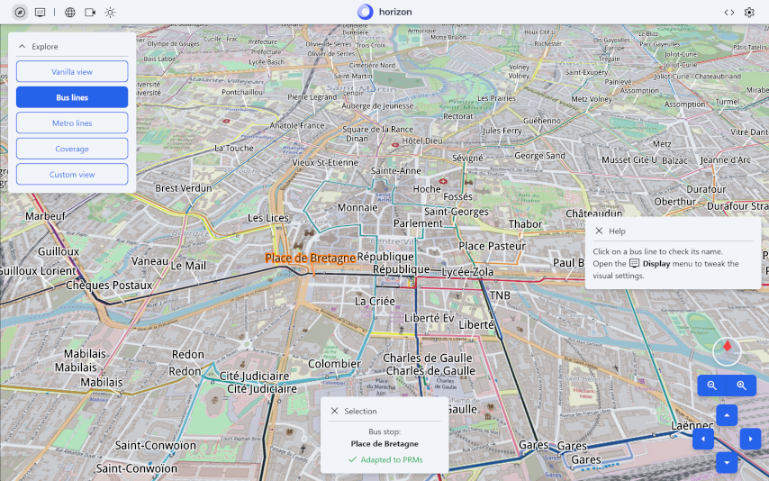</a>

* **Terrain**
    * Display tens of dynamically-streamed rasters worldwide down to centimeter-resolution as both imagery and DTM.
    * Supports TMS, WMS, WMTS, ArcGIS, TileJSON, PMTiles, Bing, and many more source formats.
    * Dynamically colorize rasters containing arbitrary data like electro-magnetic field intensity, solar irradiance, etc.

    <a href="public/terrain.png">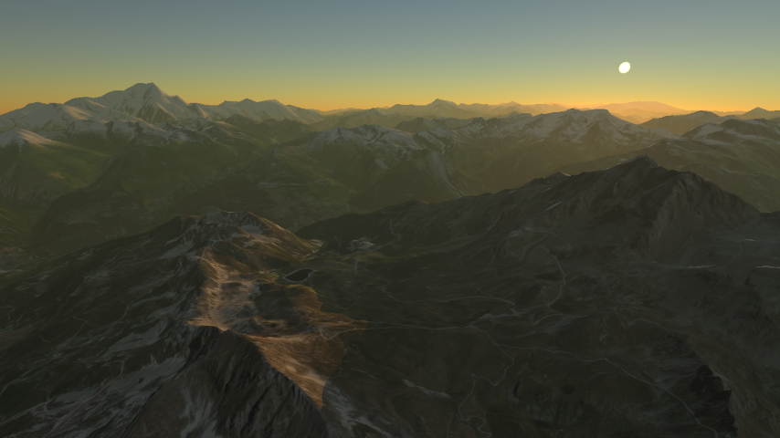</a>

* **Graphics**
    * Get full control over lighting & ambiance using the beautiful simulated atmosphere, or any setting suiting your use case.

    <a href="public/ambiance.png">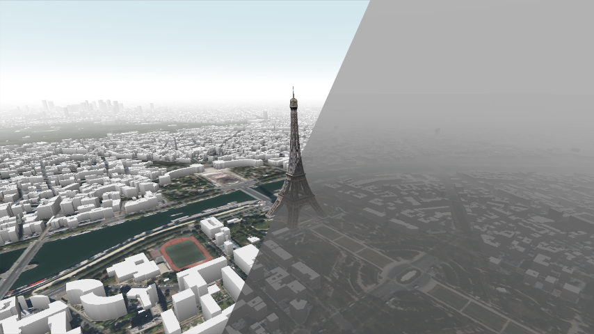</a>

* **Vector**
    * Import dynamically-streamed vector data from hundreds of sources, and combine them to augment your data analysis capabilities.
    * Supports PMTiles, TileJSON, GeoJSON, Mapbox Vector Tiles, Geobuf, local or application-driven, and much more.
    * Visualize your data in 3D thanks to extruded polygons, cylinders, and instanced 3D models.
    * Create insightful maps by drawing your vector data on the terrain, with polygons, polylines, points, and heatmaps.
    * Create fully-customizable symbols with a flexible layouting engine for detailed toponyms or labels.
    * Use the powerful styling script system to dynamically create vector representations, filter and stylize data.
    * Import Mapbox scenes for all your base map needs.

    <a href="public/rennes.png">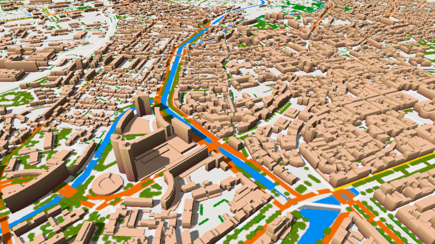</a>
    <a href="public/ign.png">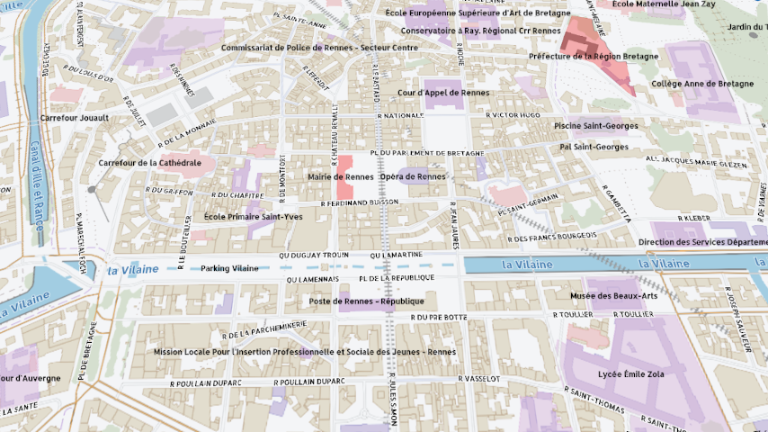</a>
    <a href="public/heatmap.png">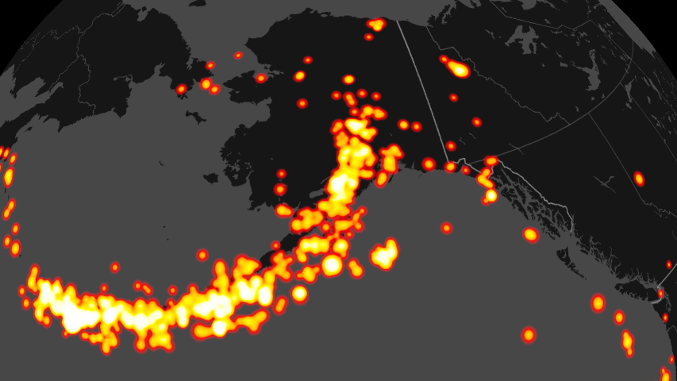</a>
    <a href="public/trees.png">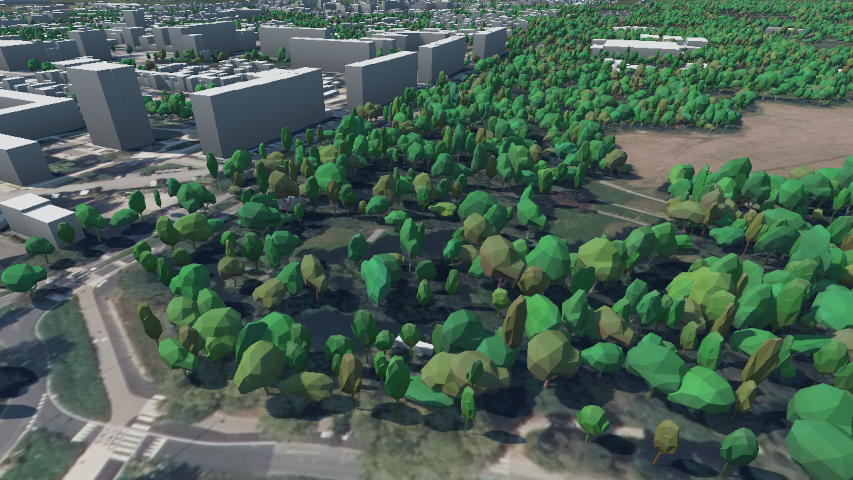</a>

* **3D models**
    * Visualize glTF and 3D Tiles models or point clouds. From human-scale objects to city-scale (or even larger) datasets such as digital twins.
    * Use the styling script system to stylize and filter your models.
    * Use the multi-materials & dynamic materials binding system to dynamically visualize computation results on your digital twins.

    <a href="public/multitexturing.png">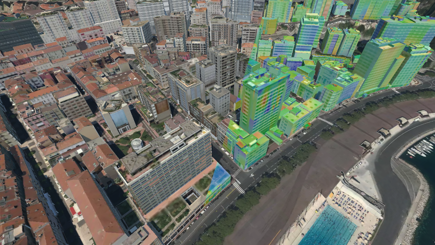</a>
    <a href="public/3dtiles_coloring.png">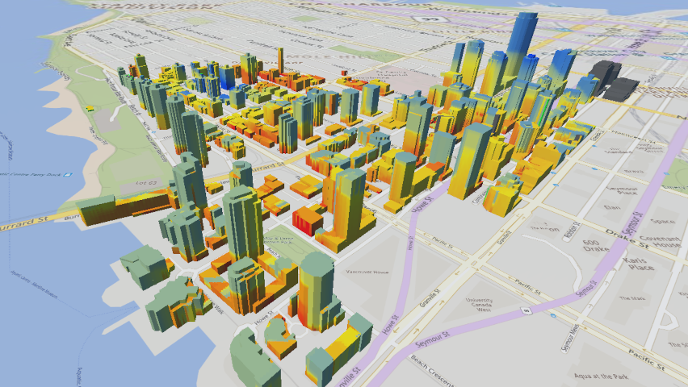</a>
    <a href="public/point_cloud.png">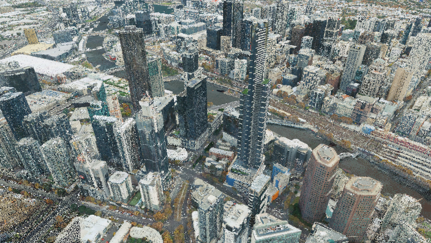</a>

* **Interactions**
    * Add multi-view capabilities to your application through the integrated ability to have two views of the same or different data.
    * Use the powerful camera system to give the exact control that you want to your user over how they navigate the scene.
    * Use application-driven vector and assets data to integrate procedural data in your scenes.
    * Add interactions to your application using the picking, selection, highlighting & gizmo systems.
    * Provide dynamic analysis capabilities with viewsheds and clipping.
    * Edit vector data directly in the 3D view using the shape editor.

    <a href="public/gizmos_clipping.webm">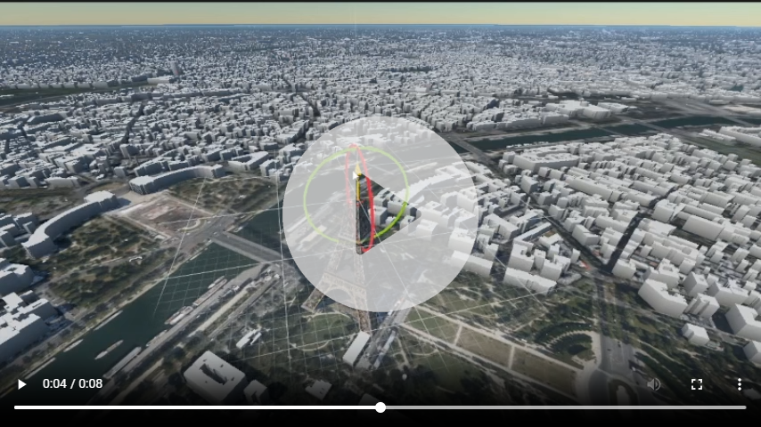</a>
    <a href="public/selection.webm">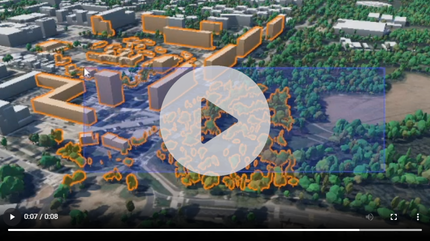</a>
    <a href="public/shape_editor.webm">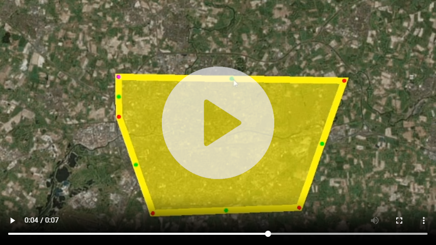</a>
    <a href="public/viewshed.webm">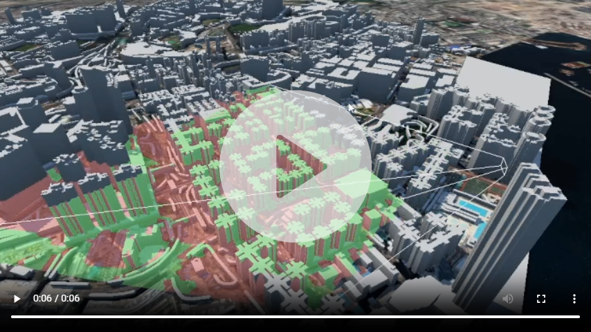</a>
    <a href="public/multiview.webm">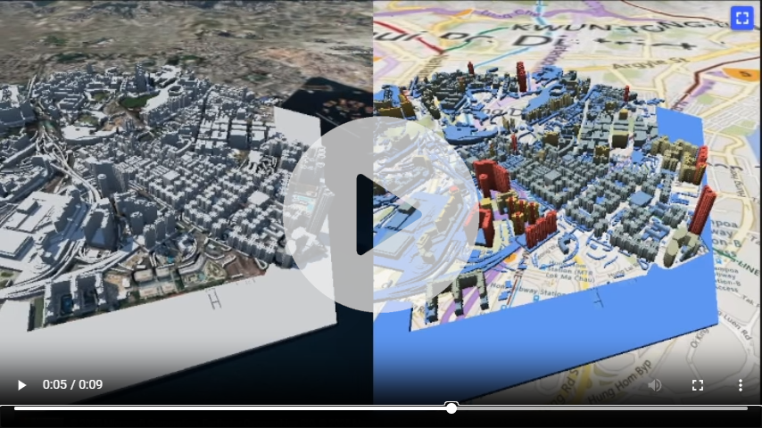</a>

## Getting started

Currently, we do not provide prebuilt artifacts. But you can [build them yourself](#building). Some integration examples are given in the [apps folder](apps/).

*Prebuilt artifacts and the full documentation will be provided at a later date.*

## Building

To build Horizon, follow the [development environment documentation](doc/src/development_environment.md) to setup your environment and learn how to build. Once you have built the artifacts, you are free to work with the engine outside of the Bazel environment if you are developing an application. Artifacts are available in the `bazel-bin` directory.

The project structure is described in the [technical documentation](doc/src/project_structure.md).

|  | Bazel target |
|-----------|----------|
| C++ viewer package | `//hrz/core:pkg_native` |
| C++ protocol library package | `//hrz/cpp_protocol:pkg` |
| C++ API library package | `//hrz/cpp_api:pkg` |
| npm TypeScript viewer package | `//hrz/ts_core:npm_pkg` |
| npm TypeScript protocol package | `//hrz/ts_protocol:npm_pkg` |
| npm TypeScript API package | `//hrz/ts_api:npm_pkg` |
| C++ integration | `//apps/native_client` |
| Web TypeScript integration example | `//apps/web_example:server` |

## Contributing

We currently do not have any robust workflow for outside contributions. Feel free to send pull requests, but we do not guarantee that they will be merged quickly, or at all. Some technical documentation is provided in the [doc folder](doc/).

## License

@Todo(1198)
