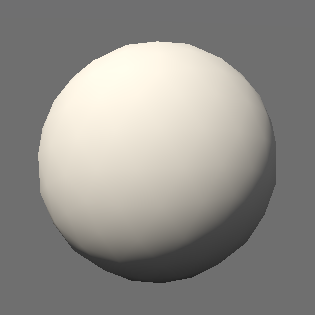
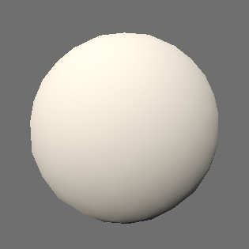
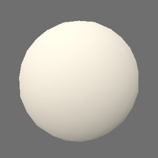

The ambient settings are part of the scene view settings. They dictate the global appearance of the scene.

<gallery-card demo="ambiance"></gallery-card>

<gallery-card demo="nonRealistic"></gallery-card>

## Lighting

For each layer, and globally, lighting and shadows can be enabled or disabled. When those flags are disabled globally (in the [[AmbientSettings]] of a [[SceneViewSettings]]), they are disabled on all scene elements.

* The lighting flag controls whether a scene element receives any lighting or appears "full bright".
* The cast shadows flag controls whether a scene element casts shadows on other elements and itself. This can be disabled for small elements that barely contribute to shadows to increase performance.
* The receive shadows flag controls whether shadows are rendered on a scene element, as part of its lighting process.

In Horizon, lighting is comprised of an ambient component and a sun component. Both have configuration options in [[AmbientLightingSettings]] and [[SunSettings]].

Ambient lighting affects the whole scene, including the parts that are in shadows of the sun light. It can be realistically computed based on the appearance of the sky, or set to a custom static color.

Sun lighting is dependent on the position of the sun, which can be set in one of three ways in [[SunDirectionSettings]]:

* It can be given by a date and a time. The date is the number of the day in the year (0-364, leap years are not handled since a single day offset barely changes anything). The time is the solar time between 0 and 24 at the current camera position: at noon the sun is at its highest.
* It can be given by an altitude angle and an azimuthal angle relative to North. This makes it easy to create precise and deliberate lighting environment, without being restricted by astronomical rules.
* It can be given by an altitude angle and an azimuthal angle relative to the direction of the camera. This makes it so that sunlight is applied equally to the elements on screen, no matter where the camera is facing.

Just like ambient lighting, the color of sun lighting can be computed using the simulated sky, or be set to a custom color.

The balance between both components can be adjusted in the [[AmbientSettings]] using the `sun_ambient_balance`: a balance of `0.5` brings equal ambient and sun lighting, `0.0` disables sun lighting completely, and `1.0` disables ambient lighting. This parameter is useful for adjusting the contrast of a scene.

The `lighting_strength` parameter is a multiplier applied to both ambient and sun lighting. It can be used to tweak the impact of lighting on the scene.

The `wrap_lighting` parameter controls how fast surfaces stop receiving sunlight. At `0.0`, they stop receiving any sunlight when their normal is perpendicular to the sun direction, while at `1.0`, they need to face the exact opposite direction.

    
Visual comparison

    

        

            
No wrap lighting

            
Half wrap lighting

            
Full wrap lighting

        

        

            

                
            

            

                
            

            

                
            

        

    

!!! note "Wrap lighting and shadows"
    It is advised to disable shadows when using wrap lighting, as they the two concepts do not work well together: as surfaces that are perpendicular to the sun direction continue to receive some sunlight, they also lie within their own shadow, which produces nonsensical results.

## Sky

The sky can be configured using the [[SkySettings]]. Two modes are available:

* It can be simulated to emulate the appearance of a clear sky. The effect of the atmosphere on the planet can be attenuated with the to improve scene readability and reproduce colours from scene objects more accurately.
* It can be approximated using two colours (one for the atmosphere, one for the outer space) as the start and end distances from the horizon at which the transition between the two colours occurs. The distances can be expressed in metres or pixels. This mode is named static mode. It can be used to deliberately create non-realistic renderings.
    * Transparent colours can be used in this mode to integrate the scene more seamlessly with the host web page.

!!! warning "Low graphics mode"
    When the engine is initialized in ["low" graphics mode](graphics_configuration.html) (either by the integration or automatically), the simulated sky, sun, and ambient lighting are disabled. Because of this, even when using the simulated settings, it is important to also provide sensible fallbacks for the static settings fields of the model, in case a user has a machine not powerful enough to have them enabled. (Unless the engine is forced to be initialized in a mode that supports the simulated modes, or the simulated atmosphere is force-enabled by the [[GraphicsSettingsOverrides]] of the [[ViewerOptions]] given at initialization.)

    In particular, providing [[SunSettings]] and [[SkySettings]] messages with no `static_color` effectively sets these colours to `(0, 0, 0, 0)`, making the scene fully black when the engine defaults to low graphics.

## Fog

Two layers of fog can be applied as post-processing effects when rendering the scene. They can heavily impact the visibility and/or atmosphere of a scene.

Each layer is independent from one another and has its own set of [[FogSettings]]. Their order matter: the `primary_fog` layer of [[AmbientSettings]] is applied first, and the `secondary_fog` is then applied over it.

Fog decreases exponentially with altitude. `falloff_start` determines the altitude at which fog starts fading out, and `falloff_end` determines the altitude at from which it becomes barely existent. The same amount of fog is applied equally to all positions at an altitude lower than `fallow_start`.

The `density` parameter controls the speed at which it reaches its maximum impact, at which the color of the underlying scene is fully blended with the fog `color`. `start_distance` defines a distance from the camera before which no fog is applied.

Finally, `apply_to_sky` controls whether the sky should be affected by the fog layer or not.

!!! note "Fog and atmospheric effects"
    When fog is enabled (which is determined by whether or not its `color` property is fully transparent), atmospheric effects that are usually applied to the planet with a simulated sky are disabled, meaning that the planet is rendered as if the `attenuation` parameter of [[SkySettings]] was set to `1.0`.

## Underground

The color of the underground can be modified. This is visible when the terrain is transparent (see the [terrain settings page](terrain_settings.html)). It can be useful to improve the visibility of underground objects seen through the terrain.
