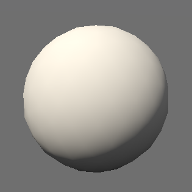
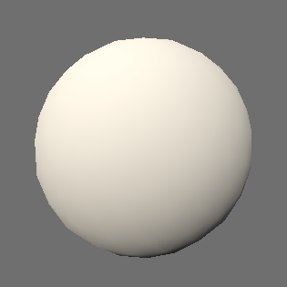
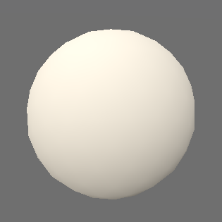

+++
title = "Ambient settings"
+++

# Ambient settings

The ambient settings are part of the scene view settings. They dictate the global appearance of the scene.





## Lighting

For each layer, and globally, lighting and shadows can be enabled or disabled. When those flags are disabled globally (in the [AmbientSettings]($proto) of a [SceneViewSettings]($proto)), they are disabled on all scene elements.

* The lighting flag controls whether a scene element receives any lighting or appears “fully bright”.
* The cast shadows flag controls whether a scene element casts shadows on other elements and itself. This can be disabled for small elements that barely contribute to shadows to increase performance.
* The receive shadows flag controls whether shadows are rendered on a scene element, as part of its lighting process.

In Horizon, lighting comprises an ambient component and a Sun component. Both have configuration options in [AmbientLightingSettings]($proto) and [SunSettings]($proto).

### Ambient lighting

Ambient lighting affects the whole scene, including the parts that are in shadows of the sun light. It can be realistically computed based on the appearance of the sky, or set to a custom static color.

### Sun lighting

#### Sun direction

Sun lighting is dependent on the position of the Sun in the sky, which can be set in a number of ways in the `direction` oneof. It is possible to choose how the Sun is positioned along two main axes:

* Does the Sun follow the camera, or it is fixed relative to the Earth.
* Is the Sun constrained to a realistic position, or can it be placed at any angle.

|                    | Sun follows camera | Sun is fixed   |
|:-------------------|:------------------:|:--------------:|
| Realistic position | `solar_date`       | `solar_date` with `at_prime_meridian`, `calendar_date`, `unix_time_ms` |
| Free position      | `angular_direction` with `camera_frame` | `angular_direction` with `geographic_position` |



##### `solar_date`

This mode allows setting the solar time, through a time in the day and a day in a theoretical year (or a position of the Earth along its orbit around the Sun).

By default, the time is the local solar time at the camera. The Sun keeps its position in the sky as the user moves the camera westward or eastward, but it gets higher or lower as the user moves toward or away from the poles.

When `at_prime_meridian` is set, the time is specifically the solar time at longitude 0° (i.e. [UTC](https://en.wikipedia.org/wiki/Coordinated_Universal_Time)). The Sun is then fixed with respect to the Earth and changes position in the sky when the user moves the camera.

##### `calendar_date`

Same as `solar_date` with `at_prime_meridian` set, but the date is a Gregorian calendar date and the time can  offset to the UTC time, usually derived from the time zone.

##### `unix_time_ms`

Same as `solar_date` with `at_prime_meridian` set, but the date and time are expressed through a single integer, in the form of a [Unix time](https://en.wikipedia.org/wiki/Unix_time) value in milliseconds. Because this setting is a single integer, with no discontinuities, it is useful when animating or interpolating time.

##### `angular_direction`

The Sun’s position in the sky is directly set with azimuth and altitude angle values. The `reference` oneof picks the frame in which the two angles are measured.

When it is `camera_frame`, the angles are always relative to the camera’s position, so the Sun appears fixed on the sky as the camera moves. The frame is one of:

* `FRAME_ENU`: the azimuth is measured from the North and the altitude from the local horizontal plane. This is also the frame used when `reference` is not set.
* `FRAME_CAMERA_HEADING`: the azimuth is measured from the direction the camera looks at, projected onto the local horizontal plane, and the altitude still from that plane. The camera can rotate to change its heading and the Sun follows it, keeping its position on screen, but tilting the camera up or down does not affect the Sun’s position in the sky.
* `FRAME_CAMERA`: both angles are measured in the camera’s own basis, so the Sun keeps its exact position on screen when the camera moves or rotates.

This makes it easy to create a consistent precise and deliberate lighting environment, without being restricted by astronomical rules, and wherever the camera is located.

When it is `geographic_position`, the azimuth and altitude angles are measured from that location on Earth, so the Sun changes position in the sky when the user moves the camera.

#### Sun colour

Just like ambient lighting, the colour of sun lighting can be computed using the simulated sky, or be set to a custom colour.

### Other lighting settings

The balance between both components can be adjusted in the [AmbientSettings]($proto) using the `sun_ambient_balance`: a balance of `0.5` brings equal ambient and sun lighting, `0.0` disables sun lighting completely, and `1.0` disables ambient lighting. This parameter is useful for adjusting the contrast of a scene.

The `lighting_strength` parameter is a multiplier applied to both ambient and sun lighting. It can be used to tweak the impact of lighting on the scene.

The `wrap_lighting` parameter controls how fast surfaces stop receiving sunlight. At `0.0`, they stop receiving any sunlight when their normal is perpendicular to the sun direction, while at `1.0`, they need to face the exact opposite direction.

| `wrap_lighting = 0.0` | `wrap_lighting = 0.5` | `wrap_lighting = 1.0` |
|:----------------:|:-----------------:|:-----------------:|
|  |  |  |

> [!note] Wrap lighting and shadows
> It is advised to disable shadows when using wrap lighting, as they the two concepts do not work well together: as surfaces that are perpendicular to the sun direction continue to receive some sunlight, they also lie within their own shadow, which produces nonsensical results.

## Sky

The sky can be configured using the [SkySettings]($proto). Two modes are available:

* It can be simulated to emulate the appearance of a clear sky. The effect of the atmosphere on the planet can be attenuated with the to improve scene readability and reproduce colours from scene objects more accurately.
* It can be approximated using two colours (one for the atmosphere, one for the outer space) as the start and end distances from the horizon at which the transition between the two colours occurs. The distances can be expressed in metres or pixels. This mode is named static mode. It can be used to deliberately create non-realistic renderings.
    * Transparent colours can be used in this mode to integrate the scene more seamlessly with the host web page.

> [!warning] Low graphics mode
> When the engine is initialized in ["low" graphics mode](graphics_configuration.html) (either by the integration or automatically), the simulated sky, sun, and ambient lighting are disabled. Because of this, even when using the simulated settings, it is important to also provide sensible fallbacks for the static settings fields of the model, in case a user has a machine not powerful enough to have them enabled. (Unless the engine is forced to be initialized in a mode that supports the simulated modes, or the simulated atmosphere is force-enabled by the [GraphicsSettingsOverrides]($proto) of the [ViewerOptions]($proto) given at initialization.)
>
> In particular, providing [SunSettings]($proto) and [SkySettings]($proto) messages with no `static_color` effectively sets these colours to `(0, 0, 0, 0)`, making the scene fully black when the engine defaults to low graphics.

## Fog

Two layers of fog can be applied as post-processing effects when rendering the scene. They can heavily impact the visibility and/or atmosphere of a scene.

Each layer is independent from one another and has its own set of [FogSettings]($proto). Their order matter: the `primary_fog` layer of [AmbientSettings]($proto) is applied first, and the `secondary_fog` is then applied over it.

Fog decreases exponentially with altitude. `falloff_start` determines the altitude at which fog starts fading out, and `falloff_end` determines the altitude at from which it becomes barely existent. The same amount of fog is applied equally to all positions at an altitude lower than `fallow_start`.

The `density` parameter controls the speed at which it reaches its maximum impact, at which the color of the underlying scene is fully blended with the fog `color`. `start_distance` defines a distance from the camera before which no fog is applied.

Finally, `apply_to_sky` controls whether the sky should be affected by the fog layer or not.

> [!note] Fog and atmospheric effects
> When fog is enabled (which is determined by whether or not its `color` property is fully transparent), atmospheric effects that are usually applied to the planet with a simulated sky are disabled, meaning that the planet is rendered as if the `attenuation` parameter of [SkySettings]($proto) was set to `1.0`.

## Underground

The color of the underground can be modified. This is visible when the terrain is transparent (see the [terrain settings page](terrain_settings.html)). It can be useful to improve the visibility of underground objects seen through the terrain.
