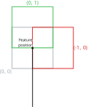

+++
title = "Anchor symbol element"
+++

# Anchor symbol element

An [AnchorSymbolElement]($proto) is an invisible element that physically places its child element in the world. For this reason, an anchor _must_ be present at the root of any symbol composition for it to be displayed. An anchor is originally placed at the feature position.

## Axis alignment

Anchors have several parameters that can be tweaked to alter where a symbol is placed and how it is displayed. The first important set of parameters chooses how to align the symbol (`x_axis_alignment` and `y_axis_alignment`). Each axis defines independently its alignment to be either relative to the world or to the screen. When an axis is defined to be align in the world it follows the ENU frame orientation of the anchor position. For example, setting the `x_axis_alignment` to be relative to the screen space and the `y_axis_alignment` to be in world space creates a cylindrical symbol behavior where the symbol rotates around the normal to the ground at the anchor to face the camera.

This reference frame can also be rotated using the `rotation` of the anchor. This rotation is applied using the X and Y aligned axes (Y here uses the same convention as the 3D parts of the engine and points towards the top of the symbol, instead of towards the bottom, which is the convention when layouting elements inside the symbol), and the Z axis is the normal to both X and Y, using the defined extrinsic rotation order.

One usual example is placing a symbol flat to the ground with a bearing, for example for road names. This can be achieved by:

* Choosing the world alignment for both the X and Y axes
* First rotating on the Z axis by the bearing
* Then rotating on the X axis by 90° so that the Y axis is aligned with the floor instead of up.
* This can be achieved using the ZYX order.

Note that there are many ways of doing the same thing. For instance the X rotation could be applied first, and then a rotation on the Y axis using the bearing angle.

## Element alignment

By default, a symbol is centered at the feature position (In gray below). This can be changed by modifying the element alignment property. The alignment unit is relative to the symbol space where `(-1, 1)` is the bottom left and `(1, -1)` is the top right. The following image illustrates this behaviour.

## Position offset and units

In addition to the element alignment, it is possible to change the symbol position by specifying an offset relative to the feature position in the `position_offset` field. The offset unit can be specified to be either in pixels or meters. This offset is applied in ENU space.

## Relative scales

Relative scales can be used to dynamically scale an element, whose size is in pixels, based on its distance to the camera. There are two types of relative scaling, which are controlled by the `position_offset_relative_scaling` and `element_size_relative_scaling` properties.

- When `SYMBOL_RELATIVE_SCALING_REF_DISTANCE` is used, the element size defines its size at the specified `reference_distance`. Then, the element grows or shrinks based on the distance to the camera and on the scale factors. The `min_relative_scale` and `max_relative_scale` factors are used to prevent the element from being too small or too large. The following illustrates the behaviour of relative scaling:

. When the distance is greater than 1000 m the size is clamped at a minimum of half the original size (25 pixels).")

- When `SYMBOL_RELATIVE_SCALING_CAMERA_HEIGHT` is used, there is no need to specify a `reference_distance`. Instead, the height of the camera is used as the reference distance, and the size of elements are scaled based on their distance from that. `min_relative_scale` and `max_relative_scale` are still applied. A small correction is applied when the camera is tilted, to make it so that elements close to the camera appear larger than the specified size, while further ones appear smaller. When the camera faces straight down, all elements appear at their specified size.

- Relative scaling can be disabled altogether by using `SYMBOL_RELATIVE_SCALING_NONE` (which is the default).

As for which scaling mode should be used, it depends on the scene and the kind of symbol: for instance, `SYMBOL_RELATIVE_SCALING_CAMERA_HEIGHT` can pair well with properly tiled datasets that keep a manageable amount of points visible at any level of detail, keeping symbols at a readable size no matter the altitude; whereas `SYMBOL_RELATIVE_SCALING_REF_DISTANCE` can make scenes using single level datasets more readable by scaling down the symbols as the camera moves away.

## Children unit

Finally, an anchor defines the size unit of its child elements, in pixels or meters.

## Multiple anchors

A symbol can have multiple anchors in which case it represents different parts of a single symbol that can be placed in the world, or on the screen, at different places.
