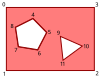

Vector data (geometry and attribute values) is typically retrieved from distant sources through HTTP requests, by fetching files such as MVT or GeoJSON. There are however two ways through which the client can directly provide data to Horizon: in-memory and client vector sources.

!!! note "Using a custom asset URL"
    A third way is available, using a [custom asset request](client_asset_data.html). We will not go into details about how this works here, as it is just a way of serving files (such as MVT or GeoJSON) though the [message queue](message_queue.html) instead of HTTP requests, and is orthogonal to vector data.

    For example imagine using a tiled provider with an URL such as `client:my-vector-dataset/{z}/{x}/{y}`, and using this information to serve or generate some GeoJSON data client-side.

## In-memory vector source

<gallery-card demo="markers"></gallery-card>

[In-memory vector source layers](HrzProtocol.InMemoryVectorSourceLayer.html), and the [associated provider](HrzProtocol.InMemoryVectorDataProviderParams.html), offer a way to store persistent vector data inside the Horizon instance. Along with the definition of the layers, the client pushes the vector data, which can then be used by vector data layers.

The layer declares which attributes it has values for, which attributes constitute the feature ID, as well as data for any number of features. Each feature can have a geometry and values for every attribute of the layer. When a vector data layer wishes to pull data from an in-memory vector source layer, it has to use the same definition of a feature ID.

Whatever its bounding box and max zoom level are, a vector data layer can pull data from an in-memory vector source layer. If the vector data layer requests data at tile coordinates for which the in-memory vector source layer does not contain features, the vector data layer receives an empty tile.

### Feature coordinates

Three types of geometries are available: points, polylines, and polygons. They all use the same API for setting their coordinates: the `coords` array. The client is expected to fill this array by chaining X, Y, and Z coordinates for each invididual vertex of the feature, and chaining the vertices themselves.

The `coords` array is filled like this:

| 0 | 1 | 2 | 3 | 4 | 5 | 6 | ... |
|:-:|:-:|:-:|:-:|:-:|:-:|:-:|:-:|
| vertex 0, X  | vertex 0, Y | vertex 0, Z | vertex 1, X | vertex 1, Y | vertex 1, Z | vertex 2, X | ... |

If the last vertex does not have three coordinates, it is ignored.

#### Points

Point features only use the first vertex of the array. The following vertices, if they exist, are ignored.

#### Polylines

Polylines are generated by joining all the vertices in the order they are declared, if the `linestring_sizes` array is empty.

If the `linestring_sizes` array is not empty, then we are working with a multi-polyline: for each number in that array, a polyline of that size is generated using the next vertices from the `coords` array (starting from the first).

    

In this example, each vertex is labeled with its position in the `coords` array. The first polyline has two vertices, and the second has three. So in this case the `linestring_sizes` array must contain `[2, 3]`.

!!! note ""
 If you need a polyline that makes a loop without having to declare the first and last points as equal, use a polygon instead.

#### Polygons

Polygons are more complex, as they can be multi-polygon, composed of an outer linestring, and a collection of smaller, inner linestrings that define holes in the outer one. Just like the other geometry types, they only use a single `coords` array, but it is complemented by the `linestring_sizes` array.

Each linestring is a polygon, defined by a list of vertices that form a closed loop. The last vertex is automatically joined to the first one. (So there is no need to repeat any vertex.)

The `coords` array must contain all the vertices for the outer polygon, in anticlockwise order, followed by the vertices for the first hole, in clockwise order, followed by the vertices for the second hode, also in clockwise order, and so on.

The `linestring_sizes` array indicates how many vertices comprises each linestring, in the same order as in the `coords` array.

    

In this example, each vertex is labeled with its position in the `coords` array. The outer linestring has four vertices, the first inner linestring has five, and the last one has three. So in this case the `linestring_sizes` array must contain `[4, 5, 3]`.

## Client vector data

<gallery-card demo="liveData"></gallery-card>

<gallery-card demo="csvData"></gallery-card>

A [[VectorDataSource]] with a `provider_type` of `CLIENT_VECTOR_DATA_PROVIDER` enables Horizon to pull data from the client. When such a source is used, Horizon uses the [message queue](message_queue.html) to signal that it needs data from the client, sending a [[VectorDataRequestMessage]].

It is the client’s responsibility to listen for such messages, and respond to those requests with the necessary data using the `ProvideVectorData` method of [[ClientDataService]].

Data can be requested either by tile coordinates or feature IDs: this is determined by the `access` field of [[ClientVectorDataProviderParams]].

!!! note "Geometry requests"
    Client geometry can only requested using tile coordinates. If a [[VectorDataSource]] has geometry, the `access` field of its [client provider](HrzProtocol.ClientVectorDataProviderParams.html) **must** be set to `ACCESS_BY_TILE`.

### Answering a vector data request

The contents of the [request message](HrzProtocol.VectorDataRequestMessage.html) determines the contents that should be included in the response.

The `vector_data_layer_id` and `vector_data_source_index` fields identify the vector data source responsible for initiating the request, in the case where there are multiple sources that use a client provider.

The `selection` union determines the features that require data:

- With an `ACCESS_BY_TILE`, `tile_selection` contains the coordinates of the tile whose features require data. The `features` array of the [response](HrzProtocol.VectorDataRequestResponse.html) must include one entry per feature geometry in the tile (IDs can be duplicated between multiple geometries). If the source responsible for the request is **NOT** the geometry-defining source for the layer, then **the order of the features in the response must match the order of the features as declared by the geometry-defining source of the layer**, including potential duplicate feature IDs.

!!! note "Tile coordinates"
    Horizon uses the [XYZ tiling scheme](https://www.maptiler.com/google-maps-coordinates-tile-bounds-projection) for vector tile coordinates. It is the same one that is used by multiple raster tile providers, such as [OpenStreetMap](https://wiki.openstreetmap.org/wiki/Slippy_map_tilenames).

- With an `ACCESS_BY_FEATURE_ID`, `feature_id_selection` contains an array of [feature IDs](HrzProtocol.FeatureId.html). The `features` array of the [response](HrzProtocol.VectorDataRequestResponse.html) must include one entry per feature ID, **in the same order**, and including potential duplicates.

If the [response](HrzProtocol.VectorDataRequestResponse.html) has the incorrect number of features, an error is reported in the logs, and the data is not used. If the order of the feature is incorrect, Horizon will have no way to tell, and the features will have the wrong attribute values.

The [response](HrzProtocol.VectorDataRequestResponse.html) consists of a ticket and an array of [[ClientFeature]]s. Each feature can include attribute values and/or geometry.

- Each feature must contain as many attribute values as there are IDs in the request's `attribute_ids` field. **The values must be in the same order as the IDs**, including potential duplicates.

- Geometry should only be included if the request's `expects_geometry` is `true`. If geometry is included nonetheless, it is ignored. The `expects_geometry` field is provided as a convenience, as it mirrors the value of the requested [[VectorDataSource]]'s `has_geometry`.

!!! note "Geometry format"
    The geometry has the same format as the one used for in-memory vector sources, which is described above. However, the coordinates of the geometry must be in the Web Mercator ([EPSG:3857](https://epsg.io/3857)) projection.

The response must be sent using the `ProvideVectorData` method of the [[ClientDataService]] using the request's `ticket`.

### Invalidating vector data

Vector data used by Horizon can be invalidated using the `InvalidateVectorData` method of [[ClientDataService]]. When data is invalidated, it will be requested and loaded again. Which data should be invalidated is determined by the [parameters passed to the method](HrzProtocol.VectorDataInvalidation.html).

First, a specific [[VectorDataSource]] should be identified with a `vector_data_layer_id` and `vector_data_source_index` (the latter being the index of the source in the `sources` array of the [layer definition](HrzProtocol.VectorDataLayer.html)).

!!! note ""
    Any vector data source can be invalidated, not just the ones with client providers.

Then, the `selection` union is used to determine which features should be invalidated.

- If `tile_coords` is set, all features of the corresponding tile will be invalidated.
- If `feature_ids` is set, all features with the given IDs will be invalidated (some other features may also be invalidated with them).
- If `everything` is set, then all features within the data layer will be invalidated.

!!! note "Vector data sources and client data invalidation"
    It should be noted that the contents of a vector data request is determined by the contents of its associated [[VectorDataSource]]. For instance:

    - If a vector data layer has one client source defining two attributes, then the two attributes will be requested within the same message.
    - If a vector data layer has two client sources defining one attribute each, then the two attributes will be requested across two different messages.

    This has important consequences when invalidating the values of one of the two attributes:

    - In the first case, a single request will be sent, asking for the values of both attributes again, as both are defined in the same vector data source.
    - In the second case, a single request will also be sent, but asking for the values of the invalidated attribute only, as the other attribute originates from a different source.

    As such, if it is known that the values of a specific attribute will be frequently invalidated, it is advised to define this attribute in a separate source.
