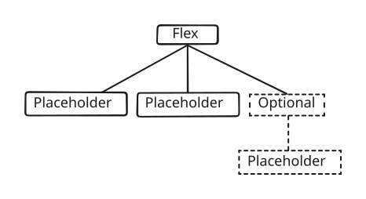
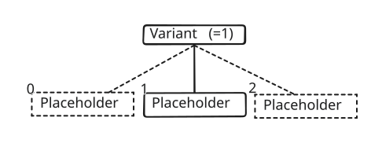

+++
title = "Conditional symbol elements"
+++

# Conditional symbol elements

## Optional

The [OptionalSymbolElement]($proto) is used to make a symbol element optional. When an element is optional it can be rendered or not depending on the `display_child` property. The child element of the optional is rendered when the property is true.

## Variant

The [VariantSymbolElement]($proto) is used to select which of its children to render. The child to render is selected by using the `displayed_child_index` property. The children are indexed from 0 to N. The property can be set per feature in styling scripts. It can be used, for instance, to select which sub-part of a symbol to render based on an attribute.

