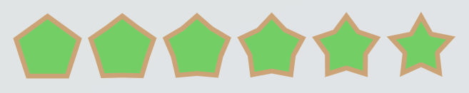

+++
title = "Decorated shape symbol element"
+++

# Decorated shape symbol element

A [DecoratedShapeSymbolElement]($proto) is a visual element that is fit to the minimum size constraints given by its parent to draw a parametric shape.

## Fitting

Decorated shapes use a [box fit](reference/HrzProtocol.BoxFit) parameter to decide how they should be laid out inside or around the minimum size constraints. This parameter acts the same way as for [fitted boxes](layout_symbol_elements.html#fittedbox). An alignment can also be applied to place the shape relative to its constraints. Note that since decorated shapes do not have a fundamental size, their initial size is the minimum size constraints they receive. If the aspect ratio parameter is non-zero, the initial height is adjusted to respect the aspect ratio. Here are a few examples:

- To surround some content by a circle, use an alignment of (0, 0) to center the shape, a `COVER` fit mode to fully surround the content, and an aspect ratio of 1 so that the circle is indeed a circle.
- To add a simple rectangle backdrop to some content, set the aspect ratio to 0 to preserve the aspect ratio of the minimum constraints, and set the fit mode to `FILL` so that it fills the bounds fully without caring about aspect ratio.

## Shapes

There are four shapes available. There are three basic shapes that are a rectangle, a circle and capsule (a rectangle whose smallest sides are fully rounded). The fourth shape is a regular polygon. A border can be added to any shape. A main colour and a border colour are configurable as well.

Rectangles and capsules fill all the available space. Circles and regular polygons keep an square aspect ratio and thus only fill the middle of rectangular regions. It can be useful to use an [align](layout_symbol_elements.html#align) and an [aspect ratio](layout_symbol_elements.html#aspectratio) to control the position of such shapes.

## Regular polygons

Regular polygons have a configurable number of sides with a minimum of 3 where 3 sides is a triangle, 4 is a diamond, 6 an hexagon, etc.
In addition to its number of sides a regular polygon also has a star factor between 0 and 1 that controls how much the edges should be bent to make the polygon look like a star. Below is an illustration of this for a pentagon with a star value going from 0 to 0.5.

## Rounded corners

A border radius can be added on rectangles and regular polygon to make the corners rounder. This radius is given using the same units as the rest of the symbol.
