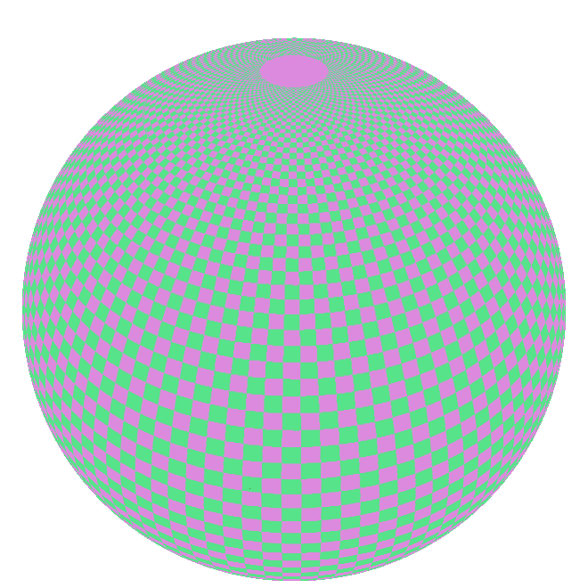
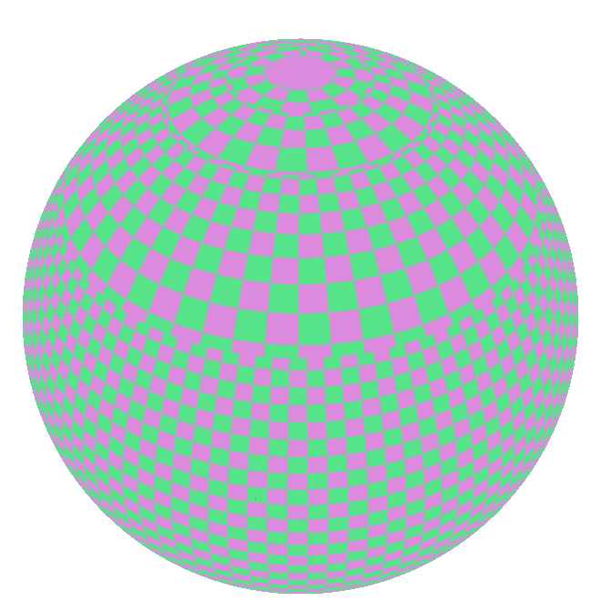

A [flat overlay](HrzProtocol.FlatOverlayVectorRepr.html) is a 2D representation where features are draped onto the ground. It can be convenient for vector data that does not need to be visualised in volume (roads, railways, areas).

* Polygons can be filled or displayed as an outline (in which case they are treated as polylines).
    * Filled polygons can be drawn with just a solid colour, or tiled with a pattern image.
    * The pattern is drawn on top of and blended with the first colour.
    * The pattern itself can be coloured with a secondary colour.
    * Although the sprite definition accounts for stretchable areas, they are ignored when drawing patterns on polygons.
* Polylines can be filled, dashed, or have only one of their sides displayed.
* Points are displayed as discs and can have an outline.
* Polyline widths and point radii can be expressed in either metres or pixels.
* Different flat overlay representations can be combined to create complex representations like having a filled polygon with a dashed outline on the inside.

!!! note "Animation support"
    Polylines dashes (including polygon outline dashes) can be animated using the `animation_speed` property. Be aware that the engine will have to redraw the entire scene at every update when any animated feature is visible on screen, which will have a strong impact on the device's power consumption.

### Polygon pattern reference latitude

Polygon patterns form grids on the surface of the planet. A grid cannot be laid out on a sphere without sacrificing either of shape or size consistency. The `polygon_pattern_tiling_type` property allows choosing whether the grid is unbroken, but pattern instances are smaller toward the poles, or the sizes are more consistent but the grid is broken at multiple latitude lines. At these places, the scale of the patterns is doubled, trading global consistency for local size uniformity.

If the first option (favour the grid) is chosen, the reference latitude determines where the pattern instances have the intended size. They are larger closer to the equator and small closer to the poles.

If the second option (favour the pattern size) is chosen, the break in scale can appear at an undesirable place, depending on where the scene is located. This can be avoided by setting the reference latitude, and then the scale breaks are pushed away from it.

It is also possible to use the position of the camera to determine the reference latitude. In this case, though at any moment the scale breaks are away from the camera (or non-existent when the grid is favoured), they can exist between frames as the camera moves.

    
Visual comparison

    

        <ul class="tabbed-figure-header">
            <li>Favour grid</li>
            <li>Favour size</li>
            <li>Favour size, with reference latitude</li>
        </ul>
        

            

                <figure style="text-align: center;">
                    
                    <figcaption style="font-style: italic;">Polygon pattern, favouring the grid</figcaption>
                </figure>
            

            

                <figure style="text-align: center;">
                    
                    <figcaption style="font-style: italic;">Polygon pattern, favouring the size</figcaption>
                </figure>
            

            

                <figure style="text-align: center;">
                    
                    <figcaption style="font-style: italic;">Polygon pattern, favouring the grid, preventing a scale break with a reference latitude (where the southernmost visible break happened before)</figcaption>
                </figure>
            

        

    

## Examples

<gallery-card demo="lesArcs"></gallery-card>

<gallery-card demo="polylineAnimation"></gallery-card>
