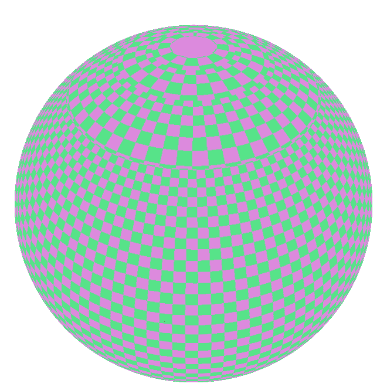

+++
title = "Flat overlays"
+++

# Flat overlays

Flat overlays are a set of 2D representations where features are draped onto the ground. They can be convenient for vector data that does not need to be visualised in volume (roads, railways, areas). There are three distinct flat overlay representations, each specialised for a specific geometry type: [FlatOverlayPolygonVectorRepr]($proto), [FlatOverlayPolylineVectorRepr]($proto), and [FlatOverlayPointVectorRepr]($proto).

## [Flat overlay points](reference/HrzProtocol.FlatOverlayPointVectorRepr)

This representation displays point features as discs that can have an outline. The radius of the discs and the width of the outlines can be expressed in either metres or pixels.

## [Flat overlay polylines](reference/HrzProtocol.FlatOverlayPolylineVectorRepr)

This representation displays line features as flat polylines that can be filled, dashed, or have only one of their sides displayed. The width of the polylines can be expressed in either metres or pixels.

Additionally this representation can also display the outlines of polygons.

> [!note] Animation support
> Dashes (including polygon outline dashes) can be animated using the `animation_speed` property. Be aware that the engine will have to redraw the entire scene at every update when any animated feature is visible on screen, which will have a strong impact on the device's power consumption.

## [Flat overlay polygons](reference/HrzProtocol.FlatOverlayPolygonVectorRepr)

This representation displays polygon features filled either with a solid colour or a tiled pattern. The pattern is drawn on top and blended with the base colour. The pattern itself can be coloured with a secondary colour.

### Polygon pattern reference latitude

Polygon patterns form grids on the surface of the planet. A grid cannot be laid out on a sphere without sacrificing either of shape or size consistency. The `tiling_type` property of [PolygonPattern]($proto) allows choosing whether the grid is unbroken, but pattern instances are smaller toward the poles, or the sizes are more consistent but the grid is broken at multiple latitude lines. At these places, the scale of the patterns is doubled, trading global consistency for local size uniformity.

If the first option (favour the grid) is chosen, the reference latitude determines where the pattern instances have the intended size. They are larger closer to the equator and small closer to the poles.

If the second option (favour the pattern size) is chosen, the break in scale can appear at an undesirable place, depending on where the scene is located. This can be avoided by setting the reference latitude, and then the scale breaks are pushed away from it.

It is also possible to use the position of the camera to determine the reference latitude. In this case, though at any moment the scale breaks are away from the camera (or non-existent when the grid is favoured), they can exist between frames as the camera moves.



{ style="height: 400px;" }

{ style="height: 400px;" }

")
{ style="height: 400px;" }


## Examples




