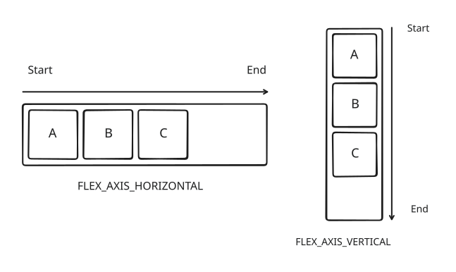
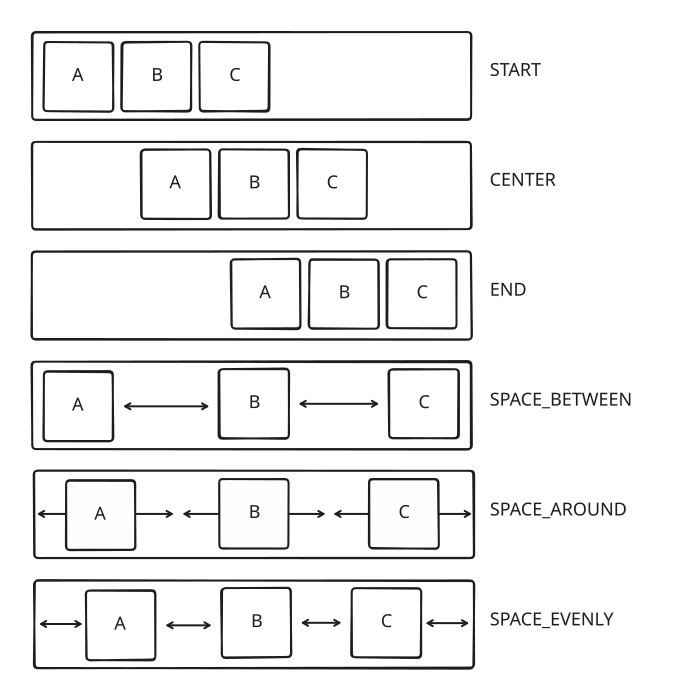
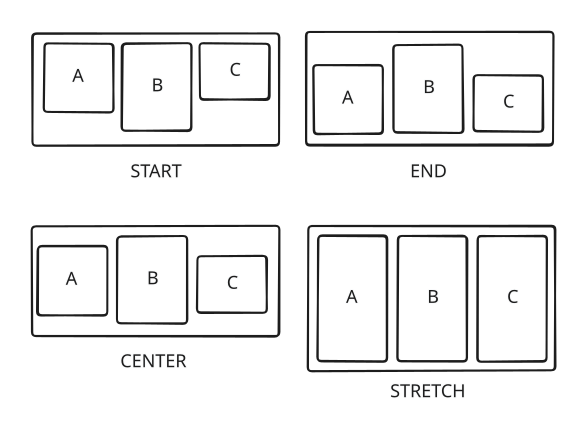
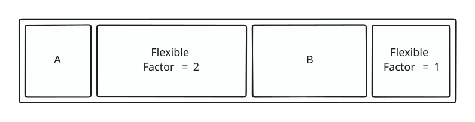

+++
title = "Flex symbol element"
+++

# Flex symbol element

The [flex symbol element](reference/HrzProtocol.FlexSymbolElement) lays out its children in a row or column depending on the chosen [main axis](reference/HrzProtocol.FlexAxis). Instead of using top, left, top and bottom, we'll refer to the sides of the main axis as start and end. The other, orthogonal, axis is called the cross axis.

> [!note]
> Despite this layout bearing the same name as the [flex layout defined by CSS](https://developer.mozilla.org/en-US/docs/Web/CSS/flex) and sharing many similarities, it is not an implementation of its CSS counterpart. Do not assume that it works the same way.

## Main axis alignment

On the main axis, the way children are distributed is controlled by the the [main axis alignment](reference/HrzProtocol.FlexMainAxisAlignment). The free space is defined as the space that is left on the main axis after the children have been laid out to reach the minimum size of the container.

* `START`, `CENTER`, and `END` keep the elements packed together but place them at the corresponding location inside the flex container.
* `SPACE_BETWEEN` distributes the free space evenly between each element, but not on the edges.
* `SPACE_AROUND` distributes the free space as equal padding around each element.
* `SPACE_EVENLY` distributes the free space evenly between each element and on the edges.

## Cross axis alignment

On the cross axis (horizontal when main is vertical, vertical when main is horizontal), children are placed depending on the [cross axis alignment](reference/HrzProtocol.FlexCrossAxisAlignment).

* `START`, `CENTER` and `END` places the children at the corresponding location on the cross axis. The size of the container on this axis is the size of the largest child.
* `STRETCH` stretches the size of the children to the maximum size on the cross axis given by the constraints of the flex container's parent.

## Flexible children

So far we have assumed that children occupy a fixed size on the main axis of the container. However it can be useful to let children get resized to take as much space as possible. To that end, all [flexible](reference/HrzProtocol.FlexibleSymbolElement) children of flex containers go through a different layouting process. Note that flexible elements have no effect when they are not direct children of flex containers.

* The flex container first lays out all non-flexible children.
* Then the remaining maximum space is computed using the sum of the non-flexible children sizes and the maximum constraint size on the main axis.
* A portion of this remaining space is then allocated to each flexible children, weighted by their `factor`. For instance if there is 300 units remaining and that there are two flexible children, one with a factor of 2 and one with a factor of 1, the first gets 200 units and the second gets 100 units.
* The flex container then lays out the flexible children with their allocated size.

There is an additional parameter: flexible children can either have a loose or a tight [fit](reference/HrzProtocol.FlexFit).

* When tight, the child must be exactly the size is it allocated.
* When loose, the child receives constraints between 0 and its allocated size. Any unoccupied space will be distributed using the main axis alignment.

