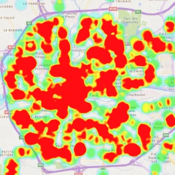
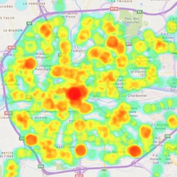

The [heatmap representation](HrzProtocol.HeatmapVectorRepr.html) is a special kind of [flat overlay representation](flat_overlays.html#flat-overlay-representation). It is used to draw aggregations of point features onto the ground, which are [colorized using a dedicated palette](numeric_palettes.html). Each point has two properties, its value and radius: in conjunction with the heatmap's palette and blur size, they define the resulting color of the heatmap at the point's location. The blur size is relative to the size of each point.

!!! important
    The number of color points in the palette is currently limited to 32.

The [[HeatmapAccumulationMode]] also changes how the values of each point is accumulated.

* The **additive** mode just adds the values. Any value can be used, but the palette can be easily saturated.
* The **weighted blended** mode blends the values such that areas of high density remain readable. However only values between 0 and 1 can be used and the accumulated values are also between 0 and 1. Failing to respect this constraint will result in undefined appearance.

| Additive | Weighted blended |
|:--------:|:----------------:|
|  |  |

## Examples

<gallery-card demo="heatmapEarthquakes"></gallery-card>

<gallery-card demo="heatmapBusCoverage"></gallery-card>
