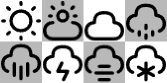
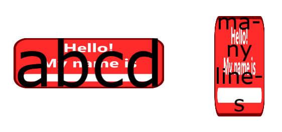
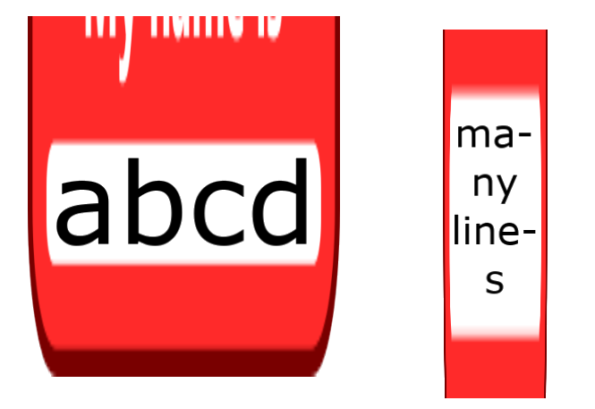
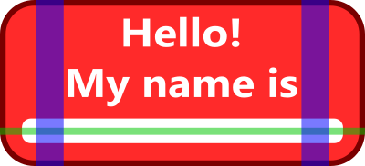
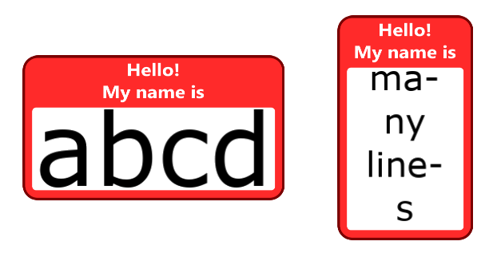

+++
title = "Image symbol element"
+++

# Image symbol element

[Image elements](reference/HrzProtocol.ImageSymbolElement) display an image in a symbol. This image can be colourised using the usual [blending modes](blend_modes.html). Multiples images can be used within the same element using a sprite sheet, or atlas. Images can be stretched to fit the minimum constraints they receive.

> [!important] Linear vs gamma colour blending
> Images are saved in the [sRGB](https://en.wikipedia.org/wiki/SRGB) colour space, which has the peculiarity of storing values non-linearly. This non-linear transfer function is called "gamma", and can be seen nowadays as a form of data compression. By using more values in parts of the colour space that the human vision distinguish best, and vice-versa, it allows saving images in 8-bits-per-channel formats without artefacts such as banding.
>
> Horizon blends colours in linear space, i.e. it undoes the gamma transfer function before mixing colours. This is the method that is intended by the sRGB specification, and it usually gives more realistic and pleasant results.
>
> However, many image editors blend colours directly in gamma space. This used to be commonplace in graphics engines but is akin to working directly on compressed data, and it can lead to undesired intermediate colours.
>
> Unexpected results can appear when images produced by these editors are displayed in Horizon. Namely, if an image file containing partially transparent pixels is saved by such an editor and then used in Horizon, the transparent areas may appear different.
>
> To ensure consistent results, use an editor that supports linear colour blending (e.g. [Krita with linear workflow](https://docs.krita.org/en/general_concepts/colors/linear_and_gamma.html)).
>
> [See here](https://alexanderhoughton.co.uk/blog/visualising-srgb-gamma-correction/) for some visual examples.

## Sizing

By default the size of the image in symbol units is the size in pixels of the source image. A scale value can be applied to resize it homogeneously.

## Colour, blending, and opacity

The colours of the image can be tinted with another colour, defined in the layer properties. The way the colours are blended together is controlled by the colour blend mode property: [see here](blend_modes.html) for more information about the different blend modes available.

## Sprite sheet

Some vector datasets require different images to be displayed depending on the context. For example a points of interest dataset in a city might require an icon with a fork to represent restaurants, a cross to represent hospitals, etc.

Instead of creating one symbol or even worse, one representation per icon, it is possible to combine all those icons in a single image and use the `sprite_index` or `sprite_name` properties to switch between them using styling scripts. Each sprite present in the sprite sheet must be defined in the `sprites` array in order to be available. Each [sprite](reference/HrzProtocol.ImageSprite) defines the region it occupies in the source image and optionally a name to be used to select it.



| Sprite name      | Offset | Size  |
|------------------|--------|-------|
| `icon_sunny`     | 0-0    | 42-42 |
| `icon_cloudy`    | 84-0   | 42-42 |
| `icon_thunder`   | 42-42  | 42-42 |
| ...              | ...    | ...   |

When a feature has been given a sprite name property with a valid value, that sprite is used, otherwise the sprite index property is used, which points to the index of the sprite in the `sprites` array. If this is not valid either, nothing is displayed. If the example script below, the attribute `weather_state` might contain values like `sunny`, `cloudy`, etc.

```
set "icon_name" = fmt("icon_{}", attr("weather_state"));
```

> [!note] Default sprite
> When no sprite is defined, an implicit default sprite that is the full size of the image is defined and used with index 0.

## Fitting content

Images can be used as background to other content, but for them to look good in this role, they need to be correctly fitted to said content. In this example, we'll try to fit some text inside this very retro-looking employee's badge.


We will setup the components like this:

* An anchor to place the element in the world
    * A **stack**
        * A **stack expand** to give the image the size of the text below
            * The **image**
        * The **text**

The first settings of interest in [ImageSymbolElement]($proto) are [fit_mode](reference/HrzProtocol.BoxFit) and [fit_axes](reference/HrzProtocol.BoxFitAxes), which dictate how the image must stretch (or not) to fit the content. Here we'll be using `BOTH` for the axes, and `FILL` for the mode, so that both the width and height of the image will match that of the content exactly. More information about the fit modes can be found with [the fitted box](layout_symbol_elements.html#fittedbox).

> [!note] Content size
> An attentive reader will have noticed that an image element does not have a child, thus what is its content's size? It is the minimum constraint size given by its parent. This can be useful when using [a stack expand](stack_symbol_element.html), a [sized box](layout_symbol_elements.html#sizedbox), etc.



The entire badge now fits the text because the minimum size constraints given by the stack expand correspond to the size of the text. This is good but we want the text to be inside the white section.

### The content box

We could use some padding around the text, but in this case there is a better way of doing that which avoids having the padding element know the size of the image. We'll set the `content` field of the [ImageSprite]($proto) that corresponds to the badge to the dashed green box shown below.

Note that the content box acts like an offset, and the image will step outside of its parent's constraints.




Now the content is correctly placed in the white box, and this box is correctly stretched to fit the text. However the whole badge image is stretched uniformly by default, which doesn't look good most of the time.

### Stretch regions

Instead, we'll use the `stretch_x` and `stretch_y` fields of [ImageSprite]($proto) to define horizontal and vertical areas that we know are safe to be stretched. This means that they are uniformly colored in the stretch direction, or at least that we accept them being stretched.

> [!note]
> Stretch regions must be inside, or at least intersect, the content box, otherwise the box will not be able to be resized. Stretch regions outside the content box will also be stretched by the same factor as regions inside the content box.





## Alignment

There are cases where the image cannot be small enough to fit the constraints. This can happen for example when the content box has too much non-stretch space, or when the image uses the `NONE` fit mode. In these cases, the image can be additionally aligned using the `alignment` property, that uses the same values as described for the [align element](layout_symbol_elements.html#align).
