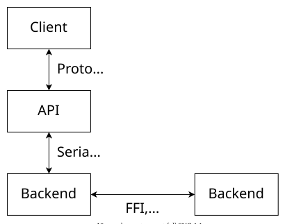

Horizon is a multiplatform geographical rendering engine. It can run on Windows, Linux and web browsers that support Web Assembly. It ships with APIs in C++ and TypeScript. Its rendering backend runs on OpenGL 3.3 for the native versions, and WebGL 2 for its web version.

Note that we call **user** the application that integrates Horizon.

!!! note ""
    The full documentation has not been made open-source yet.

## Protocol

The communication channels with Horizon are defined by [Protocol Buffers](https://developers.google.com/protocol-buffers) schemas. All commands are serialized messages sent to and from the engine. We call the set of all those messages the protocol.

## API

[The API](using_api.html) is the set of commands that can be used to communicate with Horizon. It is divided in categories called services, and methods that each have an input and output message type.

## Backend

A backend is an implementation of the API. The only thing it has to be able to do is receive and send back serialized messages as defined in the API and the protocol.

The simplest backend is [Horizon Core](getting_started.html), which is the viewer itself.

A user can implement a [custom backend](custom_backend.html) that can intercept those messages. For instance, it is possible to implement a backend sending the messages via websockets to be able to control a remote instance of Horizon. Other usecases include dumping all messages to be able to replay sessions, or having a backend that does nothing at all, useful for tests.

    

## Packages

In order to enable its integration in applications, Horizon is distributed as packages that can readily be used as build dependencies, for all target languages. The protocol, the [API](using_api.html), and the [Core backend](getting_started.html) are distributed as separate packages. (Make sure to combine packages with matching versions.)

These packages, as well as some other tools, are available [here](artifacts.html).

## Platform requirements

- 448 MiB RAM
- 256 MiB video RAM

### Native

- [OpenGL](https://www.opengl.org/) 3.3
- [SSE4.1](https://en.wikipedia.org/wiki/SSE4) SIMD instruction set support

When building with EGL as the OpenGL loader:

- [EGL](https://www.khronos.org/egl) 1.5

Optionally, OpenGL ES can be used instead of regular OpenGL, when available:

- [OpenGL ES](https://www.khronos.org/opengles/) 3.0

### Web

- [WebGL](https://www.khronos.org/webgl/) 2
- [WebAssembly](https://webassembly.org/)
    - Including [support for threads](https://github.com/WebAssembly/threads/blob/master/proposals/threads/Overview.md)
- [`SharedArrayBuffer`](https://developer.mozilla.org/en-US/docs/Web/JavaScript/Reference/Global_Objects/SharedArrayBuffer)
- The Web page must be in a [secure context](https://developer.mozilla.org/en-US/docs/Web/Security/Secure_Contexts).
- The Web server must set the following headers to these values:
    - `Cross-Origin-Opener-Policy: same-origin`
    - `Cross-Origin-Embedder-Policy: require-corp`

## Dependencies

### C++

- [protobuf](https://github.com/protocolbuffers/protobuf) 3.29.4 (lite runtime)

### TypeScript

- [protobufjs](https://www.npmjs.com/package/protobufjs) 6.11.2
