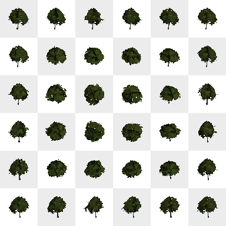

*The following example is in TypeScript, but the API is similar in all target languages.*

Point features can be represented by 3D models.

!!!note
    When used with polygons or polylines, the representation is attached to the [anchor](vector_tile_layers.html#anchor) of the feature.

<gallery-card demo="rennesTrees"></gallery-card>

### Colour, blending, and opacity

The colours of the model can be tinted with another colour, defined in the layer properties. The way the colours are blended together is controlled by the colour blend mode property: [see here](blend_modes.html) for more information about the different blend modes available.

### Impostors

Performance issues can arise when lots of models need to be displayed. To address this issue impostors can be used alongside the 3D model representation. They are configured using the [[ImpostorParams]] field in the 3D model representation configuration.

Impostors are simplified versions of a 3D model. Many thousands of them can be drawn with little to no performance hit. However they are less detailed than 3D models. Thus they are only rendered when they appear small enough on screen. This is the `max_screen_size_pixels`.

Before being drawn, impostors need to be baked. This is handled automatically, but the user is responsible for configuring this baking step. This process takes many shots of the model under various angles. The user must configure the number of shots taken, and their resolution. The `atlas_size` field configures how many shots are taken. The higher this number is, the smoother the impostor will look when moving the camera. For instance using an atlas size of 6x6 will generate 36 shots. The `image_size` field configures the size in pixels of each shot. The higher this number is, the more detailed the impostor will look. For instance using an image size of 64x64 with an atlas size of 6x6 will generate a final atlas of 384x384 pixels. Below is an example of such an atlas for a tree model.

    

!!! warning "Performance impacts of the impostors configuration"
    The atlas and image size must be chosen carefully because they impact both the baking time and the memory consumption.

    For example using an atlas of 24x24 will generate 576 shots. Only one shot is taken per frame, which means that at 60 frames per second, the impostors will only be drawn in the scene about 10 seconds after the model has been loaded.

    Since both the image size and the atlas size impact the size of the final atlas, setting those too high will use a lot of video memory. For instance with an atlas size of 24x24 and an image size of 256x256, the generated atlas will have a size of 6144x6144 pixels, thus using about 150 MB of video memory.

!!! note "Impostors configuration hints"
    Using an atlas size of 6x6 or 8x8 is usually recommended. For the image size, it directly correlates with the `max_screen_size_pixels`. Using an image size of half this value often gives acceptable results. However it is recommended to use an image size that is a power of two.

    As an example, using `max_screen_size_pixels` = 150 pixels, `atlas_size` = 6x6 and `image_size` = 64x64 is a good configuration for vegetation.

## Clipping to tile

The tile data of some vector data sources includes geometry that goes beyond the bounding box of the tiles and overlaps neighbouring tiles. This margin enables the engines to do a better job at rendering polylines and polygons. But because instanced models are point features, not only the margin isn’t needed but rendering the data it contains leads to duplicated features. To discard the margin and its features, set the `clip_to_tile` parameter to `true`.

Only set this parameter to `false` if either the tiles have no data beyond their bounds, or they do but rendering the features there is desired. (i.e. If they aren’t duplicated between neighbouring tiles.)
