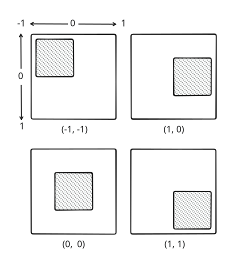
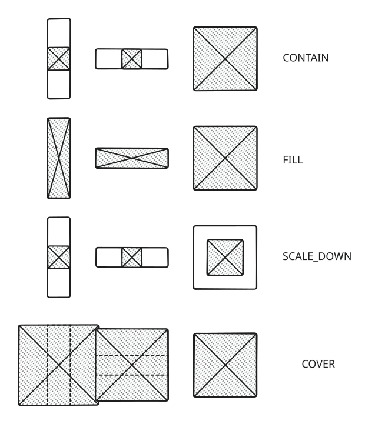

+++
title = "Layouting symbol elements"
+++

# Layouting symbol elements

## Padding

The [padding](reference/HrzProtocol.PaddingSymbolElement) element adds padding around an element by moving it inside its parent and reducing its minimum and maximum sizes.

For example, with a padding of 10 units on the left and 20 on the right, the child element will receive minimum and maximum size constraints that are 30 units smaller, and will be placed 10 units from the left edge of its parent.

## SizedBox

A [sized box](reference/HrzProtocol.SizedBoxSymbolElement) forces its child to use its given size. To do so, the minimum and maximum size constraints that the child receives are exactly the size of the sized box.

## ConstrainedBox

A [constrained box](reference/HrzProtocol.ConstrainedBoxSymbolElement) sets the minimum and maximum size constraints of its child, while also respecting the constraints of its parent. It essentially tightens the constraints it receives, unless they were already more constraining.

For example, given a constrained box with a minimum width of 0 units and a maximum width of 100 units, if a parent gives constraints between 50 and +∞ units, the child of the constrained box will received constraints between 50 and 100 units.

## Align

An [align](reference/HrzProtocol.AlignSymbolElement) aligns its child element inside itself using its alignment property that is the relative position of its child between -1 and 1 with 0 being the center and the positive axes going right and down. See the figure below.

This element can be very useful to losen minimum size constraints for a child that cannot be large enough to satisfy them.

## AspectRatio

The [aspect ratio](reference/HrzProtocol.AspectRatioSymbolElement) element forces its child to use as much space as possible while respecting the given aspect ratio.

This element must receive loose minimum size constraints (this can be done by wrapping it in an [align](#align) or [fitted box](#fittedbox) element) and bounded maximum width and/or height.

It will use the maximum size constraints, adjust them to respect the aspect ratio, and give them to its child as tight constraints, just like a [sized box](#sizedbox) would.

## FittedBox

A [fitted box](reference/HrzProtocol.FittedBoxSymbolElement) lays out its child by loosening its minimum size constraints, and then resizing the child to fit it according to its `fit` parameter, additionally aligning the child if necessary. Multiple [fit modes](reference/HrzProtocol.BoxFit) are available:

* `CONTAIN` scales the child to fill the box while respecting its aspect ratio. When the scaled child is smaller than the minimum size, it is aligned using the alignment parameter just like the [align element](#align).
* `FILL` scales the child to completely fill the box, regardless of its aspect ratio. There is no free space left.
* `SCALE_DOWN` acts like `CONTAIN` but will never scale the child up.
* `COVER` scales the child to completely cover the box while respecting its aspect ratio. This can make the child go beyond the constraints it receives from its parent.

Note that the child element is only scaled visually: the scaling happens after the child layout is computed.

## Transform

The [transform](reference/HrzProtocol.TransformSymbolElement) element visually (after layouting) transforms its child using an array of transform components.

The origin of the transform is defined by the `origin` and `alignment` field. They both define the origin of the transform but `origin` uses absolute units and `alignment` uses the same units at the [align element](#align). For example if `origin` is `(10, 10)` and `alignment` is `(0, 0)`, the origin fill be 10 units down and 10 units left of the center of the element.

The components of the transform are applied in the order they are given. So if the components array contains the transforms `[A, B, C]`, they are applied as `C * B * A`.

The components can be a translation, a rotation (with the order of the Euler angles given), a scaling, or a generic 4x4 transformation matrix.

The transform is applied in the symbol's space (X is left, Y is down, Z is towards the user). Any point that is transformed outside the symbol's plane is flattened, but perspective effects are preserved. (Division by the homogeneous W coordinate is applied.)

## RotatedBox

A [rotated box](reference/HrzProtocol.RotatedBoxSymbolElement) rotates its child by a given number of quarter turns, counter-clockwise. The rotation is applied both visually and in the layout, which means that parent elements "see" it as rotated.
