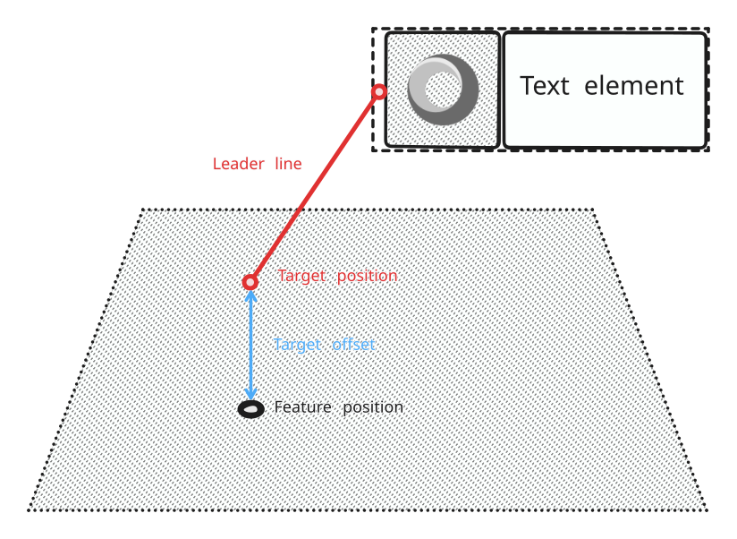

+++
title = "Leader line symbol element"
+++

# Leader line symbol element

A [LeaderLineSymbolElement]($proto) is used to display a straight line from the symbol to the feature position (the target position). This helps visually connecting the information contained in a symbol to the feature it refers to, and can make a scene more readable.

The origin of the line, on the symbol's side, depends on the element's position in the symbol tree. It can be adjusted by using all the usual layout facilities, such as [Paddings](layout_symbol_elements.html#padding) or [SizedBoxes](layout_symbol_elements.html#sizedbox). The leader line origin always takes the smallest size in the layout it can, that is to say 0x0, unless it has minimum size constraints given to it by its parent.

The target position is the feature's anchor position in the world, i.e. the feature position itself for points, the middle position for polylines, and the centroid for polygons. An offset can be applied to the target position by using the `target_offset` property.

The line colour and width can be configured globally or per instance.

It is possible to declare multiple leader lines in a single symbol. This can be useful for example when combined with [Variants](conditional_symbol_element.html#variant).

Below is an example of a leader line. The origin of the line is placed inside the symbol as a child of a [Flex](flex_symbol_element.html) element. It automatically targets the world position of the feature, to which an offset is added.

