It is possible to load and display multiple raster layers simultaneously. This can be very useful when combined with transparency and layers that do not cover the whole planet. The layers are stacked on top of each other. There is no hard limit on the number of rasters, but the more rasters are used, the more requests for tiles will be made. When tile caching is enabled, main memory usage increases. However video memory is constant, and thus not an issue.

## Order of rasters

Rasters are ordered by groups and slots. All rasters belonging to the bottom group are displayed below the middle and top groups, and all rasters belonging to the middle group are displayed below the top group. Additionally, inside each group, rasters are ordered by slot number.

    

## The importance of groups

Rasters in each group are composited together, and each group is independent. This has many consequences, for example:

- A layer that is slow to load in a group will not affect how long another layer in *another* group takes to be displayed. But all layers in the same group will wait on one another.
- When the properties of a layer in a group are changed (for example blending, visibility, etc.), all the layers in the same group need to be re-composited, but other groups are unchanged. Thus it can be useful to group layers whose visibility is often toggled on and off in a dedicated group.

!!! note "Host machine specs and multi-view"
    When the amount of video memory is low, the engine can decide to use less than three groups internally. You can still use the three groups in the layers definitions, and they will still be ordered accordingly, however the optimisations mentioned above might not be available. This can be overridden with the `imagery_merge_group_count` field of [[GraphicsSettingsOverrides]] during engine initialisation.

    Similarly, when using multi-view features, the engine might decide to merge some groups together in order to save on video memory.

## The special case of DTM layers

DTM rasters are all merged in a single group and thus the [DTM layer](HrzProtocol.DtmRasterLayer.html) doesn't provide a setting for the group.
