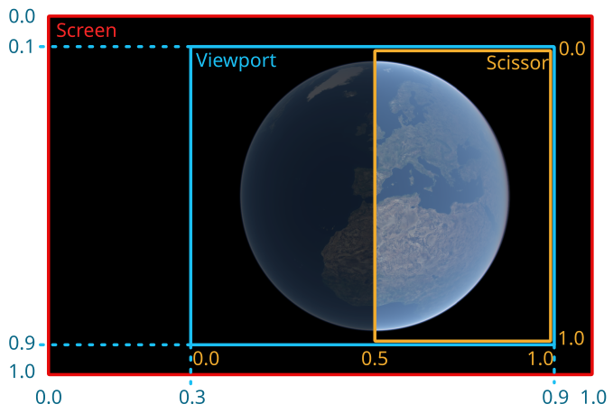

+++
title = "Multiview"
+++

# Multiview rendering

Horizon can draw multiple versions of the same scene on the screen. This is called multiview rendering. There are a few basic concepts needed to understand and use this feature effectively: cameras, scene views, viewports and scissor regions.



## Cameras

Cameras define a point a view in the scene with a given field of view. Internally they are defined by a position and a direction, which is the vector that defines the center of the view. Their vertical field of view can be configured through the [CameraSettings]($proto) root of the scene model. The position of the camera can be changed through the API (see the [camera controls](camera_controls.html) documentation) or by using a mouse, or by touch events depending on the platform.

> [!note]
> Currently there can only be at most two cameras per scene.

## Scene views

Scene views are different visualizations of the same scene. They make it possible to draw on the screen multiple versions of the scene. They are attached to a camera. All scene views attached to the same camera will show the scene from the same point of view.

The scene view settings are independent for each scene view. This makes it possible for instance to draw the same scene under different lighting conditions, or with different viewshed settings.

Each scene view is configured through a [SceneViewSettings]($proto) scene model root configured by a [SceneViewIndex]($proto).

> [!note]
> Currently there can only be a maximum of two scene views.

## Viewports and scissor regions

The viewport of a scene view defines the region of the screen on which a camera is drawn. The scissor region defines the portion of the viewport that is actually drawn. More details on how those settings are parameterized are available in the [ViewportSettings]($proto).

The scissor rectangle can be used to draw split views. Having different viewports with full scissor rectangles can be used to draw duplicate views.

Below is an example where the viewport has been configured as a rectangle from (0.3, 0.9) to (0.9, 0.9), and the scissor as a rectangle from (0.5, 0.0) to (1.0, 1.0).

When multiple viewports overlap, their associated scene view indices determine the drawing order: lowest index is drawn first (i.e. below) and highest index is drawn last (i.e. on top).

> [!note] Background colour
> If the scene view viewports do not cover the whole area of the canvas used by the Horizon instance, elements of the web page below the canvas are visible. If a specific colour is desired for the areas outside the viewports (for example to create a border between the scene views), the canvas can be set as child to a `div` with an explicit `background-color`.

## Activating scene views

Each scene view can be activated independently from the `active_views` [SceneViewBitset]($proto) field of the [SceneSettings]($proto) model root. Additionally, a main view has to be selected. The main view is used to decide what point of view (and hence which camera) is be used to compute the level of detail of some elements of the scene, such as the terrain. When only one camera is used, it doesn't make any difference which view is selected as main view.

## Layers support

> [!important] Interaction with the visibility property
> Hiding layers in individual scene views is purely visual. Even if the scene views bitset of a layer is set to 0, the engine may still download and process data related to this layer. To properly disable a layer, the integrating application should use the visibility property.

### Single models & 3D Tiles

These two layers have a `scene_views` property of type [SceneViewBitset]($proto) at their root. This bitset is used to specify in which views the layer should be shown or hidden. This setting is global to the layer

### Imagery rasters

Imagery raster layers also have a `scene_views` property of type [SceneViewBitset]($proto) at their root, allowing the user to hide it in specific views.

> [!note] Interaction with raster groups
> Enabling multiple views will disable some of the raster groups features: some rasters that previously belonged to different groups and thus could be independently composed might now wait on each other to be displayed. This will not change anything visually apart from the speed at which the rasters are composed, and the integrating application doesn't have to change anything to the layer model. Note also that the impact on the scene depends on the distribution of rasters in groups. This is an optimization to avoid allocating too much video memory in multiview contexts.

### Vector tiles

Each vector tiles layer can contain multiple representations. Each representation can be shown or hidden in specific scene views. To do so, use the `scene_views` property of the [VectorRepr]($proto) entries in the layer's style. It is also possible to control the scene views all representations are visible in using the `scene_views` property at the root of [VectorTilesLayer]($proto). A representation is visible in a view if it is activated both on the representation and on the layer.

## Using independent cameras

Each scene view can be associated to a different camera (using the `camera` field of [SceneViewSettings]($proto)). Then each camera can be manipulated independently by the user in their respective scene views.

> [!important] Choosing the right main view
> When using independant cameras, the choice of main view becomes very important. This is because not all systems are able to be displayed with the same precision or quality in each view when the viewpoint is different.
>
> All rasters have a better resolution closer to the main camera.
