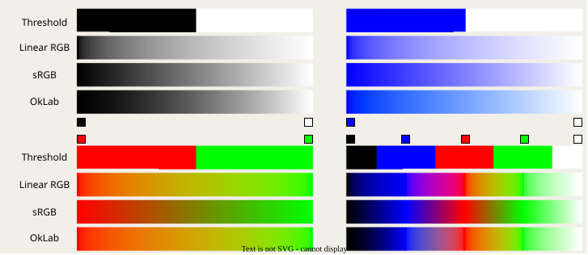

[Numeric palettes](HrzProtocol.NumericPalette.html) map numeric values to colors and are defined as:

* An array of color points that each have a numeric value, and two colors:
    * one that is applied before this value (the "first" color);
    * one that is applied after this value (the "second" color).
* A NaN color, applied when the value is [NaN](https://en.wikipedia.org/wiki/NaN) (not a number).

For each value that needs to be palettized, the second color of the point below it and the first color of the point above it are retrieved, then they are interpolated according to the selected mode.

    

## Interpolation modes

There are multiple [interpolation modes](HrzProtocol.ColorInterpolationMode.html) available that have different characteristics.

| Mode       | Interpolation | Color accuracy | Value accuracy |
| :--------- | :-----------: | :------------: | :------------: |
| Threshold  |     None      |       -        |       -        |
| Linear RGB |    Linear     |     ✅ Good     |     ❌ Bad      |
| sRGB       |    Linear     |     ❌ Bad      |     ✅ Good     |
| OkLab      |    Linear     |     ✅ Good     |     ✅ Good     |

* We recommend using OkLab since it gives the nicest, most visually intuitive results.
* sRGB is implemented because many other software components only know about this mode since it's the easiest to implement without knowledge of color spaces.

    

