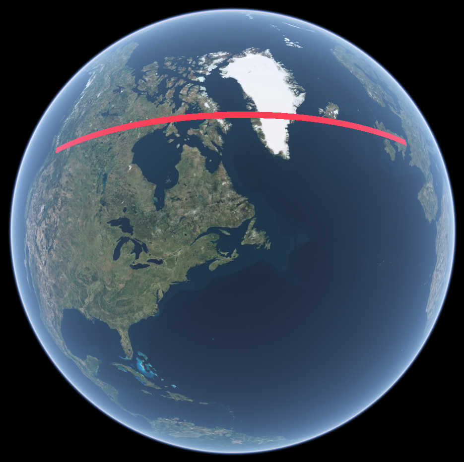
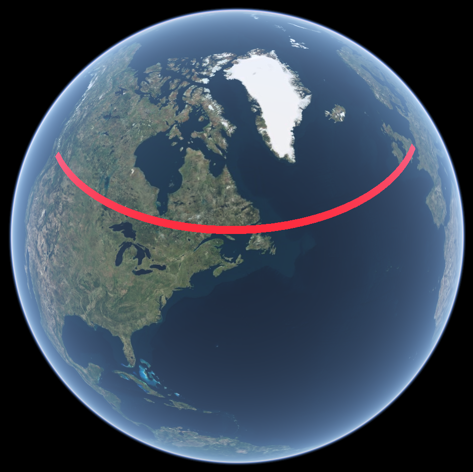
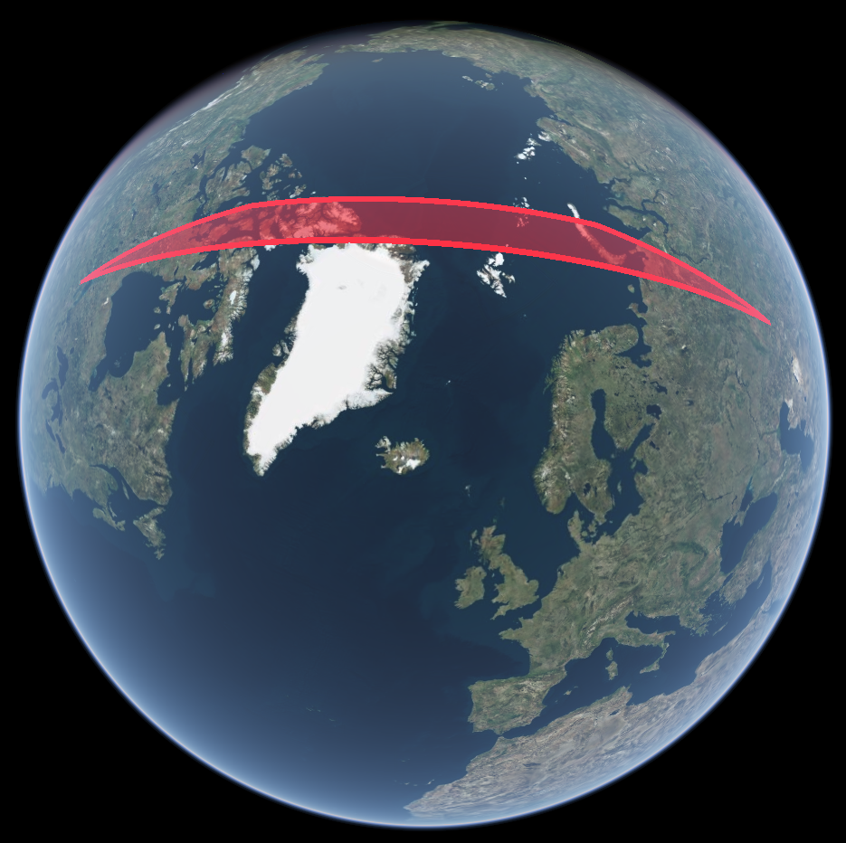
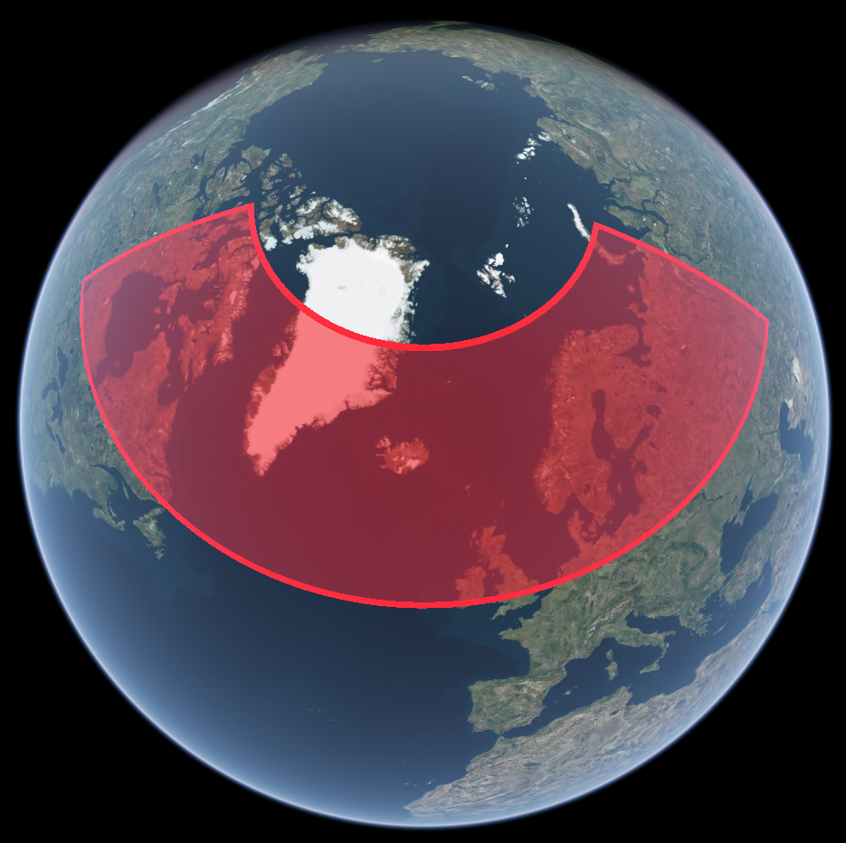
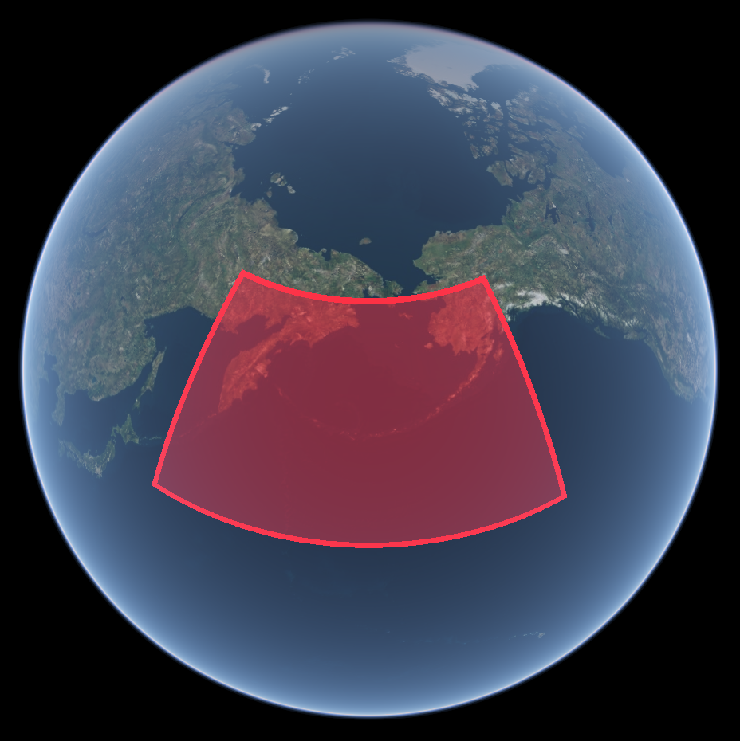
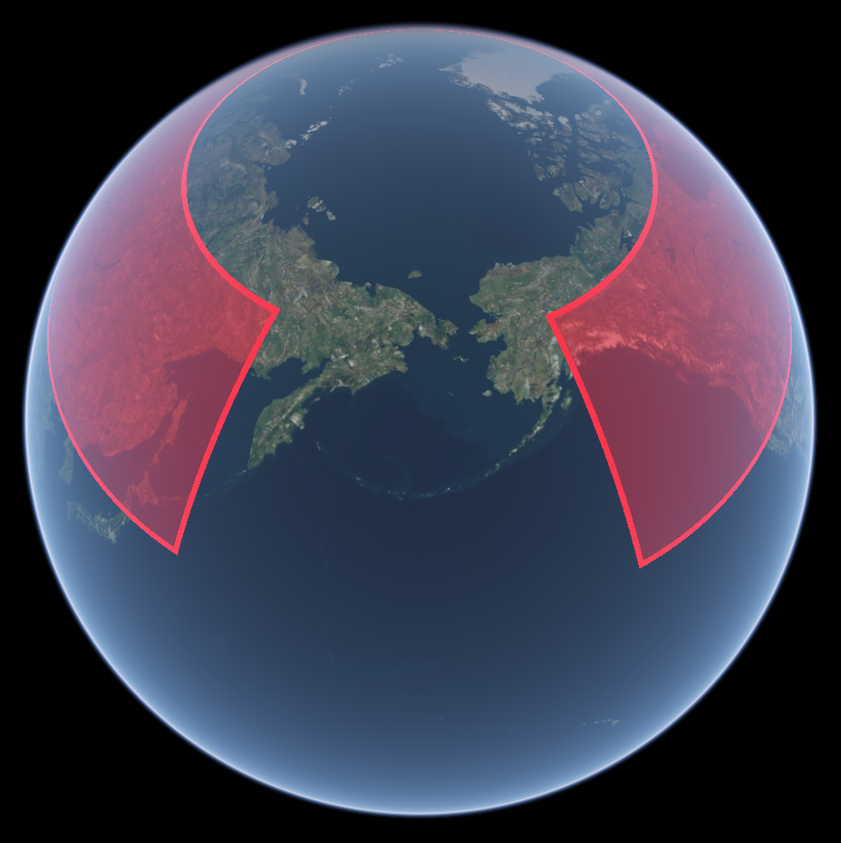

+++
title = "Shape editor"
+++

# Shape editor

Horizon allows drawing shapes (points, lines, polylines, and polygons) on the ground with the mouse, and then retrieving the coordinates of the points, as well as statistics like length and area. It is also possible to create shapes and set the coordinates of their points from the API.

## Editable shape layers

In order to draw shapes, a dedicated layer of type `EDITABLE_SHAPE` has to be created first. This layer contains all the data of the shape:

* its geometry, including the geometry type, the line type, and the positions of its points,
* its style, composed of the colour (for both lines and surfaces) and the width of the lines,
* its style when selected,
* the style (screen size and colours) of its control points,
* whether its mid-segment control points are shown or not,
* its z-index, which determines the order in which shapes are drawn,
* its visibility, including global and per-view visibility,
* how often the model is updated when the user interacts with the shape.

The geometry comprises:

* A type: point, line, polyline, or polygon.
* A line type, which specifies whether the segments follow geodesics (straight lines on the ground) or rhumb lines (lines of constant bearing).
* A list of coordinates, in WGS84 lat-lon degrees. Alternating latitude and longitude values are packed into a single number array. Each pair forms the position of a point.
* An array of linestring sizes, which is only used by polygons in order to form multipolygons. The first value tells how many points form the outer perimeter, starting from the beginning of the position list. Then each subsequent value indicates how many positions are used to form holes, each time starting in the position list where the previous one ended.

A point only uses the first position in the list. A (simple) line only uses the first two positions in the list.

On top of modifying the geometries through the layer model, these shapes can be modified by the user directly from the Horizon view. A dedicated service is there to manage the edition capabilities: the [shape editor service](reference/HrzProtocol.ShapeEditorService).

### Line types

Line segments joining two points of a shape can be either segment of geodesics or segment of rhumb lines.

- [Geodesics](https://en.wikipedia.org/wiki/Great-circle_distance) are the equivalent of a straight line on a sphere. They are also known as great circles or orthodromes. Distances on geodesics are the shortest distances between two points, i.e. "as the crow flies".
- [Rhumb lines](https://en.wikipedia.org/wiki/Rhumb_line) are line of constant bearing, i.e. the angle between the line and meridians remains constant along the whole line. A rhumb line segment never exceeds the bounding-box in latitude and longitude defined by its two points. Geometries drawn from vector data layers are defined with rhumb-line segments so editable shapes with this line type should be used when creating a editor for vector data.



{ style="width: 75%;" }

{ style="width: 75%;" }

{ style="width: 75%;" }

{ style="width: 75%;" }


Two types of rhumb lines are available: those that can cross the antimeridian and those that cannot. When two points joined together by a line segment are more than 180° apart in longitude, the segment can take a shorter way around by going from the negative longitudes to the positive ones by crossing the antimeridian. This is technically more correct but not all GIS tools support such shapes without explicitly splitting them along the antimeridian, including Horizon's own vector data layers. Use the type that matches best how the data is going to be used and displayed after its generation.



{ style="width: 75%;" }

{ style="width: 75%;" }


> [!note] Multi-polygons support
> Support for multi-polygons is currently quite rudimentary. Notably, the user cannot create them using the mouse. Their geometry has to be set through the API.

> [!important] Areas of polygons crossing the antimeridian
> The area calculation for polygons crossing the antimeridian is incorrect.

## The editor service

The editor maintains some state, that tracks what the user can do: a shape selection and a mode. By default no shape is selected, and the mode is "selection".

An editable shape can have two states: selected or deselected. At most one shape can be selected at a time. When in selection mode, a shape can selected by clicking on it. When a shape is selected, it is drawn in a visually distinctive way and its control points are visible. Control points are targets for user mouse input. There is one control point for each point of the geometry of the editable shape, as well as one at the midpoint of each line segment.

A control point can be selected by clicking on it, it can be moved by dragging it. Clicking on or dragging a midpoint control point adds a new point to the geometry of the shape.

When a control point is selected, the user can switch to the "append" state. This mode allows the user to repeatedly add points to the shape after the selected control point by clicking on the ground. It is also possible to switch to this mode when the shape has no points at all, so that a shape can be created from scratch. By clicking on the last point that has been appended, or by right-clicking, the user leaves the append mode, and goes back to the "selection" (default) mode. It is not possible to switch to the append mode if a shape and a control point are not selected.

Note that key bindings can be defined to associate keyboard keys to actions such as deleting the selected control point or switching to the "append" or "selection" mode (see the [events documentation](events_handling.html)).

Shape and mode selection can be made programmatically by calling the `SelectShape` and `SelectMode` methods of the [ShapeEditorService]($proto). Additional methods allow querying the current state. The `LockShapeSelection` method can be called to prevent the user from changing the selected shape by clicking on one (`UnlockShapeSelection` returns to the normal behaviour). If a control point is selected and is not a midpoint, it can be deleted with the `DeleteSelectedControlPoint` method.

Geometrical information on a shape can be retrieved by calling the `GetShapeInformation` method. It includes:

* the total length (or perimeter for polygons) of the shape,
* the length of each polyline (in practice, the perimeter of each linestring for multi-polygons), in the order they are in the linestring size list,
* the number of segments in each polyline,
* the length of each segment (the number of segments list can be used to know which length belong to which polyline),
* the bearing of each segment (in clockwise radians from the North), from its first point to its second one,
* the angle between each pair of consecutive segments (in clockwise radians),
* the total area,
* the area of each polygon, in the order they are in the linestring size list.

Note that these dimensions do not take the DTM into account. They are measured on the WGS84 ellipsoid's surface.

> [!note]
> Area measures are non-sensical for malformed polygons, such as self-intersecting polygons, or multi-polygons with inner linestrings that go outside the outer perimeter.

## Client messages

In order for the client to be able to build a user interface for the editor, and have this interface reflect what is happening inside Horizon, client messages are dispatched everytime a user action occurs. All relevant messages are [`ShapeEditorMessage`s](reference/HrzProtocol.ShapeEditorMessage).  The `type` field describes the kind of action that took place.

By listening to the messages (particularly `SHAPE_GEOMETRY_UPDATE` messages), and saving the intermediate states, a client can implement an undo-redo system.

## Model updates

The geometry in the model of a shape is updated when the user modifies it through direct input in the Horizon view. By default only complete actions trigger model updates. For example when a point is added, deleted, or at the end of a displacement. This is sufficient for most uses.

However, the `model_update_frequency` property of the [editable shape layer model](reference/HrzProtocol.EditableShapeLayer), of type [EditableShapeModelUpdateFrequency]($proto), can be set to force the model to be updated more often. This can be used to make GUIs that react immediately to user input, when combined with the `SHAPE_GEOMETRY_UPDATE` messages.

The `DRAG_MODEL_UPDATES` value updates the model for each intermediate position of a point that is being dragged. The `APPEND_MODEL_UPDATES` values includes information on the point that follows the mouse pointer when the editor is in append mode.

## Full edition workflow



Most of the time, the data that is used to draw vector layers in read-only, as it is downloaded from remote servers. Therefore there is no point in making the features from these layers editable.

But in the cases where the client has a means of applying modifications to the source datasets, it can use the shape editor to enable the user to create modified versions of the geometries, and then applying the modifications.

This is an outline of how it can be achieved:

* The user clicks on a feature. The client receives a picking info message.
* The client highlights the feature. If it determines that the feature belongs to a dataset that it can modify, it offers the user a way to go to an edit mode for this feature. (This mode is client-side only.)
* If the user decides to go for the edition, the client:
    * Updates the styling script or the attribute values of the vector layer, so as to hide the edited feature,
    * Downloads the geometry of the feature (untiled and not simplified, so not necessarily the geometry that is currently loaded by Horizon),
    * Creates an editable shape layer,
    * Sets the type and geometry using the downloaded data.
* The user can then use the editor to modify the geometry of the feature.
    * Ideally the client displays a GUI that helps the user track the mode and the selection.
* Once the user is done, it signals it to the client.
* The client uploads the new geometry.
    * New tiles are generated on the server.
* The client destroys the editable shape layer.
* It finally reloads the vector layer, and gets the updated tiles.

## Measuring distances and areas



The shape editor can be easily used to implement a measuring tool, as it allows the user to create shapes on the terrain, the client to retrieve their length or area.

It can be achieved in the following manner:

Have buttons in the GUI to start new measurements, one for each shape type. When the user clicks on one of these buttons:

* Create a new editable shape through the API, of the corresponding type.
    * Give it no positions, and an empty linestring size array.
    * Set its z-index to the maximum value, in order to draw the shape above potential already existing editable shapes.
    * Set its model update frequency so that it conforms to the expectations of the GUI. For example, a value of `APPEND_MODEL_UPDATES` allows the client to be notified each time the user moves the mouse, and enables updating the measured values on screen in real time.
* Save the shape layer handle as being the handle of the current measure in the tool's state.
* Select the shape through the API.
* Lock the selection to this shape.
* Put the editor in append mode.

Now the user can click on the ground to trace the shape they desire to measure.

* Each time a point is added (when the mouse is clicked) or the pointer moves, a shape update message is received.
* When it happens, call the `GetShapeInformation` method of the [ShapeEditorService]($proto), to retrieve the shape's statistics.
* Update the GUI, and display the length or area of the shape, depending on the type.

When making a new measurement, always destroy the previous shape if it exists. When closing the measuring tool, destroy the shape layer, visually ending the measure, and clear the tool's state.
