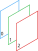
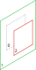

+++
title = "Stack"
+++

# Stack

## Draw order

A [StackSymbolElement]($proto) is used to accumulate and render overlapping children elements. **The order of the children is important** since it determines their render order. The child that appears first in the stack is rendered first (along with its own children) while the child at the end of the stack appears in front of all the others. The numbers in the following illustration shows a spread out view of the render order where 0 is being rendered first and 2 being rendered last.

## Children and sizes

A stack makes a distinction between _normal_ children and _expand_ children. Expand children are children of type [StackExpandSymbolElement]($proto). All the other children are considered _normal_. The size of a stack element is determined by the maximum size of all its _normal_ children. On the following illustration the green element, being the largest in the stack, determines the stack size.

### Stack expand

A [StackExpandSymbolElement]($proto) is a layout element that only has effect when placed inside a stack element. Using a stack expand inside a stack creates an _expand_ children. The stack layout strategy is different for the _expand_ children. Once the size of the stack is determined, all the _expand_ children of a stack are set to grow up to the size of the stack. This can be really useful to add a background to a symbol for example.

## Alignment

A stack lets the user configure how its children should be align relative to the calculated size of the stack. Check out the [alignment documentation](layout_symbol_elements.html#align).
