Styling features in Horizon allows users to define how features are displayed. It includes *filtering*, *colorizing*, *changing geometry*, *changing models*, etc.

It it composed of three main components:

* Features and [attributes](vector_tile_layers.html#attributes), that come from a [vector data layer](vector_data_layers.html).
* [Representations](vector_tile_layers.html#representations), that are rendering primitives (such as extruded boxes, points, heatmaps, etc.) that expose properties defining how they are displayed (such as color, font size, etc.).
* Styling scripts, which can read feature attributes, and set properties in representations. This is the main styling mechanism, and will be described here.

<div style="text-align:center;">
    
</div>

## Representation properties

Each representation has a set of predefined properties (height, colour, etc). A property can have a name and a default value. The name declared in the property is the name used in styling scripts with the `set` instruction. Thus, a property **must** have a name in order to be usable in scripts. An unnamed property or a named property not set in a script will use its default value.

A name can be duplicated among several properties but only if the properties are of the same type. This can be useful to set properties of different representations quickly (For instance, `set "color" = #f00` can set a text colour and a stem colour if the colour property is named `color` in both representations). Naturally, names can also be used to explicitly dissociate properties of different representations (For instance, having properties `text_color` and `stem_color`).

### Non-scalar properties

The `set` instruction only allows for setting scalar values. Therefore, when naming a non-scalar property, such as vectors, a virtual property is created for each component of the vector from the given name.

* For a [[Vec2Property]] the name is appended with `_x`, `_y`.
* For a [[Vec3fProperty]] the name is appended with `_x`, `_y`, `_z`.

For example, with a `Vec3fProperty` named `world_offset`, we have the following names usable in the scripts: `world_offset_x`, `world_offset_y`, `world_offset_z`.

### 3D Tiles properties

Contrarily to typical vector representations, [3D Tiles](styling_3d_tiles.html) only have a single property, whose name is not configurable: `color`.

## Palettes

The styling script supports colourization of features using a palette. A palette can be of two types: [numeric](numeric_palettes.html) or per label. The second type is a palette that maps string values to colors. Palettes are declared in the scene model with a name used for referencing the palette in the script.

Palettes are then used in the script with the `colorize()` function.

## Evaluation context

Styling scripts are evaluated for each feature, top to bottom. An evaluation context comprises the set of properties that have being set thus far in the execution of the styling script (which is empty when starting evaluation), and the RNG state of each feature ([see below](#random-number-generation)).

Further on, we will see some instructions that control the execution of the script, and the evaluation context.

## Comments

Styling scripts support single line comments by typing double slashes (`//`) on a line: everything after `//` is ignored, except when inside string literals.

```c
// This is a comment.
emit 0;
```

## Types

Styling scripts use dynamic typing, with the same [types as attributes](vector_attributes.html#types).

### Virtual types

Virtual types don't exist in the formal type system, but they are a way some operators interpret values.

| Virtual type | Acts like... |
|--------------|--------------|
| Color        | 64-bit unsigned integer, with only the first 32 bits used |

### Implicit conversions

|                | null | Boolean | Number   | 64-bit integer     | String |
|----------------|------|---------|----------|--------------------|--------|
| To number      | 0    | 0/1     | -        | May lose precision | NaN    |
| To integer     | 0    | 0/1     | floor    | Careful on signedness mismatch | 0 |
| To boolean     | false | -      | false if 0 or NaN, true otherwise | false if 0, true otherwise | false if empty, true otherwise |
| To string      | empty string | empty string | empty string | empty string | - |

## Expressions

### Operators precedence

| Precedence | Operator | Explanation |
|------------|----------|-------------|
| 1          | `()`     | Function call, sub-expression |
| 2          | `==`, `!=`, `<`, `<=`, `>`, `>=` | Comparison operators |
| 3          | `not`    | Logical negation |
| 4          | `and`    | Logical and |
| 5          | `or`     | Logical or |

For example the following expression:

```
not 1 < 2 or 3 == 4 and 5
```

would be parsed as

```
(not (1 < 2)) or ((3 == 4) and 5)
```

### Comparisons

Comparing two values happens as follows:

* If both values are of type string or (un)signed 64-bit integers, their values are simply compared normally. Note that strings are compared lexicographically.
* For mixed types or other types, both values are first *implicitly* converted to numbers before being compared.

### Logical operators

The `not` operator *implicitly* converts its value to a boolean, and inverts it.

The `or` operators returns the first values that would *implicitly* convert to `true`.

The `and` operator returns the first value that would *implicitly* convert to `false`, or `true` if none do.

```c
not null                // true
"" or "hello" or 5      // "hello"
null and 18             // null
```

### Constant folding

As an optimization, most expressions with only constant values are evaluated at compile time. This includes composite values constructed from function calls.

```c
add(mul(3, 5), 2)                       // compiled as `17`
alpha(rgb(1, 0.5, 0), attr("alpha"))    // compiled as alpha(#ff8000, attr("alpha"))
```

## Values

### Literals

#### Boolean literals

`true` and `false`. Easy.

#### Number literals

Integer literals are simply a bunch of digits. Hexadecimal values can be used by prefixing the literal with `0x`. A minus sign can be appended to decimal literals to make them negative.

Floating point literals use a period to separate the decimal and fractional parts.

```
53    -57    0x6edf    89.63    -0.5
```

#### Color literals

Color literals use the hexadecimal notation `#rgb` or `#rgba` or `#rrggbb` or `#rrggbbaa`.

!!! important
    Hexadecimal numbers (0xabcdef) are interpreted differently than special color hexadecimal values. Thus, 0xffff00ff yields a different colour than #ffff00ff. So do not use the hexadecimal integer literal notation for colors, and vice-versa.

#### String literals

String literals are delimited by double quotes `"`. They are span multiple lines, in which case the newline characters are part of the string. They can include UTF-8 characters. The following escape sequenced are available.

| Escape sequence | Description |
|-----------------|-------------|
| `\"`            | Double quote |
| `\\`            | Backslash |
| `\n`            | Line break |
| `\t`            | Tabulation |
| `\u{hhhh}`      | Unicode code point, hexadecimal.<br />For example `\u{e9}` is `é`, `\u{6587}` is `文`.  |

### Uniforms

Uniforms are read-only values not known at compile time. They can be used to provide data to the styling script from the layers. They are accessed using the `uniform("name")` syntax, where the name is a string literal.

| Uniform name | Context | Type | Description |
|--------------|---------|------|-------------|
| `tile_z`     | Vector tiles | `uint64` | Depth of the tile in the tiles pyramid |
| `tile_depth` | 3D Tiles | `uint64` | Depth of the tile in the tree hierarchy of the dataset |

```c
set "color" = hsl(mul(uniform("tile_z"), 100), 0.5, 0.5);
```

### Properties

The current value of a property can be retrieved in an expression using the `prp("name")` syntax, where the name is a string literal.

The returned value is the last value set in the current evaluation context, or the default value coming from the scene model if the property has not been written to by the script yet.

```c
set "roof_color" = hsl(rand_unif_f(0, 360), 0.5, 0.5);
set "base_color" = darken(prp("roof_color"), 0.5);
```

### Enumerations

Some enumerations defined in the protocol are usable in styling scripts. Their values are unsigned integers. They are accessible through the `enum("EnumName", "VARIANT_NAME")` directive, which takes two string literal parameters.

The enumerations that can be used in a script are [listed here](style_enums.html).

```c
set "alignment" = enum("TextAlignment", "LEFT_ALIGNED")
```

### Attributes

Attribute values can be retrieved using the `attr("name")` syntax, where the name is a string literal referring to an attribute declared in the layer. They are read-only and per-feature.

## Set instruction

The `set` instruction assigns a value given by its associated expression to a property in the current evaluation context. The given property name must be a string literal.

```c
set "color" = #F00;
set "secondary_color" = darken(prp("color"), 0.5);
set "name" = "Building 1";
```

## Discard instruction

The `discard` instruction stops the current evaluation context. It can be used to filter out a feature.

```c
if (not attr("is_visible")) {
    discard;
}
```

## Emit instruction

The `emit` instruction creates a representation instance using the current evaluation context, and stops execution.

It uses as argument an expression evaluating to an integer or a string whose value is the representation ID or name.

```c
emit "simple_extrusion";
emit 5;
emit attr("repr_name");
emit add(attr("sprite_id"), 10000);
```

!!! note
    The most efficient way of emitting representations is using a literal value. Using a dynamic value like an attribute is the slowest method, but sometimes cannot be avoided.

!!! note
    Only one representation can be emitted at a time, per evaluation context. For emitting more, using the `fork` instruction.

## Fork instruction

The `fork` instruction duplicates the current evaluation context and executes it in its instructions block. Execution of the duplicated context will stop and the end of the block. The parent evaluation context continues ignoring the block.

This can be used to emit multiple representations, possibly with different property values.

It is allowed to fork inside another fork.

```c
set "color" = "red";

fork {
    emit "repr1"; // color = red
}

fork {
    set "color" = "blue";
    emit "repr2"; // color = blue
}

fork {
    // Nothing emitted here, execution stops for this context
}

emit "repr3"; // color = red
```

## Branch instructions

Branch instructions can be used to conditionally execute instruction blocks. They use an expression whose result is *implicitly* converted to a boolean to decide whether the block is executed or not.

The available instructions are `if`, `elif`, and `else`.

`else` does not use a condition expression.

Braces are **NOT** optional.

```c
if (attr("type") == "Monument") {
    emit "monument_repr";
}
elif (attr("type") == "Tree" and attr("height") >= 5) {
    emit "tree_repr";
}
else {
    discard;
}
```

## Built-in functions

Functions can be used in any expression. Unless specified otherwise, the arguments are *implicitly* cast to their target type.

### Numeric operations

| Function | Description |
|----------|-------------|
| `abs(a, b: number) -> number` | Absolute values |
| `add(a, b: number) -> number` | Addition (a + b) |
| `sub(a, b: number) -> number` | Subtraction (a - b) |
| `neg(a: number) -> number` | Negation (-a) |
| `mul(a, b: number) -> number` | Multiplication (a x b) |
| `div(a, b: number) -> number` | Division (a / b) |
| `inv(a: number) -> number` | Negation (1 / a) |
| `mod(a, b: number) -> number` | Remainder of the floored division a / b |
| `lerp(a, b, t: number) -> number` | Linearly interpolates between a and b using t |
| `round(a: number) -> number`| Rounding to nearest integer |
| `floor(a: number) -> number`| Rounding down |
| `ceil(a: number) -> number`| Rounding up |
| `min(a, b: number) -> number` | Minimum of a and b |
| `max(a, b: number) -> number` | Maximum of a and b |
| `is_nan(a: any) -> boolean` | Checks whether a is `null` or NaN when *implicitly* cast to a number |

### Random number generation

Each features in each evaluation context has its own <abbr title="Random number generation">RNG</abbr> state. The RNG is seeded with the feature ID to ensure reproducibility across tiles of different zoom levels. This means that a feature in a dataset will always be stylized the same way for a given styling script.

For features without IDs the engine uses a best effort strategy to generate visually acceptable randomness, but stability across tiles is not guaranteed.

All random numbers are generated on 32 bits.

| Function | Description |
|----------|-------------|
| `rand_norm_f(mean, std: number) -> number` | Random real number following a normal distribution |
| `rand_norm_i(mean, std: number) -> number` | Random integer number following a normal distribution |
| `rand_norm_u(mean, std: number) -> number` | Random unsigned integer number following a normal distribution |
| `rand_unif_f(min, max: number) -> number` | Random real number following a uniform distribution, upper bound is exclusive |
| `rand_unif_i(min, max: number) -> number` | Random integer number following a uniform distribution, upper bound is exclusive |
| `rand_unif_u(min, max: number) -> number` | Random unsigned integer number following a uniform distribution, upper bound is exclusive |

### Color manipulation

| Function | Description |
|----------|-------------|
| `rgb(r, g, b: number) -> color` | Creates a color from red, green, blue components (each in [0, 1]). Alpha is fully opaque. |
| `rgba(r, g, b, a: number) -> color` | Like `rgb`, but with alpha (opacity) in [0, 1]. |
| `hsl(h, s, l: number) -> color` | Creates a color from hue [0, 360], saturation, and luminance [0, 1]. Alpha is fully opaque. |
| `hsla(h, s, l, a: number) -> color` | Like `hsl`, but with alpha (opacity) in [0, 1]. |
| `alpha(color: color, alpha: number) -> color` | Sets the alpha (opacity) of a color. `alpha` is in [0, 1]. |
| `lighten(color: color, amount: number) -> color` | Lightens the color by `amount` (0 = no change, 1 = white, -1 = black). Opposite of `darken`. |
| `darken(color: color, amount: number) -> color` | Darkens the color by `amount` (0 = no change, 1 = black, -1 = white). Opposite of `lighten`. |
| `brighten(color: color, amount: number) -> color` | Brightens the color by `amount` (0 = no change, -1 = black, 1 = double brightness). |
| `saturate(color: color, amount: number) -> color` | Saturates the color by `amount` (0 = no change, -1 = fully desaturated). Opposite of `desaturate`. |
| `desaturate(color: color, amount: number) -> color` | Desaturates the color by `amount` (0 = no change, 1 = fully desaturated). Opposite of `saturate`. |
| `invert_color(color: color) -> color` | Inverts the RGB channels of the color. |
| `mix_colors(from_color: color, to_color: color, t: number) -> color` | Interpolates between two colors in OkLab space by `t` in [0, 1]. |
| `rotate_hue(color: color, amount: number) -> color` | Rotates the hue of the color by `amount` degrees in HSV space. |
| `colorize(palette: string_literal, value: any) -> color` | Maps a value to a color using a named [palette](#palettes). |

### Strings manipulation

| Function | Description |
|----------|-------------|
| `fmt(format: string_literal, arg0, arg1, ...: any) -> string` | Builds a string. Accepts a variable number of arguments of any type. The first argument is a string literal that describes the format, which follows the [{fmt} syntax](https://fmt.dev/latest/syntax.html). |

Example:

```c
fmt("{} has {} inhabitants.", attr("city"), attr("population"));
```

### Typing & utilities

| Function | Description |
|----------|-------------|
| `is_null(expr: any) -> boolean` | Returns whether a value is strictly null. Useful for checking missing attributes. |
| `value_or(a: any, b: any) -> any` | Returns the first value if not null, otherwise returns the second value. |
| `to_int(expr: any) -> int` | Converts a value to an integer using the corresponding [attribute transform](HrzProtocol.AttributeTransform.html). |
| `to_uint(expr: any) -> uint` | Converts a value to an unsigned integer using the corresponding [attribute transform](HrzProtocol.AttributeTransform.html). |
| `to_number(expr: any) -> number` | Converts a value to a real number using the corresponding [attribute transform](HrzProtocol.AttributeTransform.html). |
| `to_string(expr: any) -> string` | Converts a value to a string using the corresponding [attribute transform](HrzProtocol.AttributeTransform.html). |
| `to_boolean(expr: any) -> boolean` | Converts a value to a boolean using the corresponding [attribute transform](HrzProtocol.AttributeTransform.html). |
| `to_color(expr: any) -> color` | Converts a value to a color using the corresponding [attribute transform](HrzProtocol.AttributeTransform.html). |
| `mapbox_typeof(expr: any) -> string` | Returns a string describing the value category: "null", "boolean", "number", or "string". This doesn't fully describe the typing system, but is meant to be compatible with Mapbox types. |

## Examples

<gallery-card demo="labelPalette"></gallery-card>

<gallery-card demo="csvData"></gallery-card>

<gallery-card demo="heatmapEarthquakes"></gallery-card>

<gallery-card demo="rennesTrees"></gallery-card>
