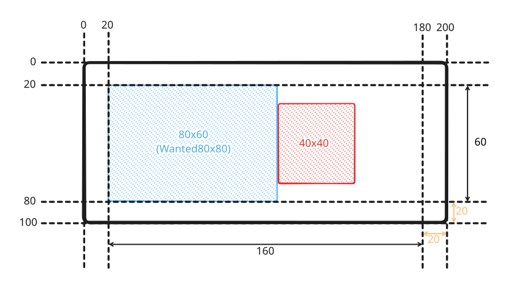

+++
title = "Symbols"
+++

# Symbols

Symbols in Horizon are 2D object that add symbolic information into a scene, placed in a 3D world. Symbols can be complex in appearance but are built from a composition of simple elements. They are a versatile representation that can compose many elements such as text, icons, shapes, to create a wide variety of visual representations. They are also very flexible in their layout, allowing to easily position elements relative to each other and to the feature they represent.

A symbol is composed of multiple elements and has layout capabilities to easily place elements of a symbol relative to one another. There are two main types of elements: visual elements and layout elements. A visual element is a visible part of a symbol whereas a layout element isn't visible but participates in placing the different visible parts of the symbol.

All the existing symbol elements are described further down below. But first, in order to fully understand how to create symbols, one needs to understand how the layout system works.

> [!note]
> When used with polygons or polylines, the representation is attached to the [anchor](vector_tile_layers.html#feature-anchors) of the feature.









## Layout system

The symbols layout system is inspired from the Flutter design. Therefore, it follows the same high level concept of *"Constraints go down. Sizes go up. Parent sets position."*

A constraint is simply four numbers that specify a minimum width and height, and a maximum width and height.

So, in more details:

- An element receives a constraint from its parent. From there, depending on the element layout strategy, it gives to its children their constraints (which can be different that the one it received from its parent).
- Then, the element asks all its children about their sizes (which respect the given constraints).
- The element then positions all its children with regard to its own constraint and finally returns its own size to its parent.

The example above shows the final composition of a symbol after the layout phase. Let's go though a simplified layout procedure using hypothetical elements for the sake of understand the flow of constraints and sizes. What we want is:

- A black-bordered box that is 200x100 pixels, and has 20 pixels of padding inside of it.
- Inside the black box, a row of two boxes: one blue and one red.
- The blue box wants to be 80x80 pixels.
- The red box wants to be 40x40 pixels.

The layout system deduces positions and sizes has follows:

- First, the black element is the root element, so receives a minimum size of 0 and an infinite maximum size.
- It needs a fixed size of 200x100, so both the minimum and maximum sizes use this value. The constraint is now said to be tight.
- It also needs 20 pixels of padding on all sides, so it reduces the constraints sizes by this value, which become 160x60.
- Now the black element will layout the blue and red elements in a row.
- The blue element receives a minimum size of 0x0 and a maximum size of 160x60. It has enough room on the horizontal axis (80 pixels) but is forced to use only 60 pixels instead of 80 on the vertical axis. So it tells its parent, the black element, that it is of size 80x60.
- The black element now reduces the available horizontal size by the size of the blue element, and starts layouting the red element.
- The red element receives a minimum size of 0x0 and a maximum size of 80x60. It can fit so just returns its size, 40x40.
- Now the black element knows the size of all its children so it can layout them so they appear in a row, properly aligned, and respecting the 20 pixels padding.

In Horizon, this setup would be a bit more complex: a visual element cannot have children, overlapping is handled by a stack, and as such the black element just becomes a decoration that is properly sized. Please refer to each element's documentation for more information. Here is a possible implementation (omitting the anchor):

- Sized box of 200x100
    - Stack to overlap the red and blue elements on the black
        - Stack expand so that the black element is as large as possible while encompassing the other children of the stack (here the padding element)
            - The black rectangle
        - Padding of 20 pixels
            - Flex with an horizontal direction
                - Sized box of 80x80
                    - The blue rectangle
                - Sized box of 40x40
                    - The red rectangle

## Elements

### Layout elements

The following elements are used to layout single elements (and their children).

- [Padding](layout_symbol_elements.html#padding) to add spacing around an element.
- [SizedBox](layout_symbol_elements.html#sizedbox) to force an element to have a given size.
- [ConstrainedBox](layout_symbol_elements.html#constrainedbox) to tighten the size constraints of an element.
- [Align](layout_symbol_elements.html#align) to align an element inside its parent.
- [AspectRatio](layout_symbol_elements.html#aspectratio) to force an element to have a fixed aspect ratio inside its parent.
- [FittedBox](layout_symbol_elements.html#fittedbox) to resize an element to take up some amount of space inside its parent and align it.
- [Transform](layout_symbol_elements.html#transform) to visually transform an element in 3D.
- [RotatedBox](layout_symbol_elements.html#rotatedbox) to rotate an element by quarter turns.

The following elements are used to layout multiple elements together.

- [Flex](flex_symbol_element.html) to layout elements in rows or columns.
- [Stack](stack_symbol_element.html) to stack elements on top of each other.

### Anchor element

- [Anchor](anchor_symbol_element.html) to position a symbol in the world.

### Visual elements

- [Placeholder](placeholder_symbol_element.html) to display a placeholder rectangle.
- [Image](image_symbol_element.html) to display an image (or an atlas of images) that can stretch.
- [Decorated shape](decorated_shape_symbol_element.html) to display a shape (circle, rectangle, star, etc).
- [Text](text_symbol_element.html) to display a text.
- [Leader line](leader_line_symbol_element.html) to draw a line from the symbol to the feature position.

### Conditional elements

- [Optional](conditional_symbol_element.html#optional) to selectively choose whether or not display its child.
- [Variant](conditional_symbol_element.html#variant) to selectively choose which child to render.

## Screen-space culling

Symbols and their subparts can be hidden automatically to not overlap other symbols, in order to improve scene readability. The visibility of an entire symbol is determined by analyzing each of its anchor. The subtree of each anchor can be hidden independently. Culling can be controlled through several parameters in [AnchorSymbolElement]($proto):

- `can_overlap_other_symbols` dictates whether this anchor can be displayed even if it would visually interact with another symbol that has already been placed.
- `hides_other_symbols` dictates whether this anchor will participate in collision detection with other symbols.
- `is_optional` dictates whether this anchor can be hidden independently from the rest of the symbol, if it allows the rest of the symbol to be displayed. This is because by default a symbol is displayed if each of its anchor is displayable. If any one cannot be displayed, the whole symbol is hidden. This option circumvents this for this particular anchor.

Some common examples are:

- Disabling culling completely is done with `can_overlap_other_symbols=true`, `hides_other_symbols=false`.
- Enabling full culling is done with `can_overlap_other_symbols=false`, `hides_other_symbols=true`.
- Other combinations can be considered depending on the needs of each scene and dataset.

In addition, symbols can be assigned a priority. This value allows controlling the culling process at the instance level, which can greatly improve the readability of the scene. For instance, text labels indicating the name of a city should probably never be hidden by labels indicating street names. This can be achieved in one of two ways:

- For symbols belonging to different representations, the `z-index` property of their representations is checked: lower z-indices are hidden by higher values.
- For symbols belonging to the same representation or two representation of equal z-index, the `culling_priority` property of their [AnchorSymbolElement]($proto) is checked: lower priority values are hidden by higher values.
- If the previous checks could not define an order between two symbols, the one furthest to the camera plane is hidden by the other.

In short, use the representation's `z_index` property to assign priorities to entire symbol representations, and the [AnchorSymbolElement]($proto)'s `culling_priority` to further customize the priorities of symbols within the same representation.

## Disabling occlusions

Symbols have the `ignore_world_occlusion` parameter that allows them to never be occluded by the terrain or other elements in the scene. The only exception is with UI elements like the gizmos or grids which are still drawn above the symbols.

## Clipping to tile

The tile data of some vector data sources includes geometry that goes beyond the bounding box of the tiles and overlaps neighbouring tiles. This margin enables the engines to do a better job at rendering polylines and polygons. But because symbols are point features, not only the margin isn't needed but rendering the data it contains leads to duplicated features. To discard the margin and its features, set the `clip_to_tile` parameter to `true`.

Only set this parameter to `false` if either the tiles have no data beyond their bounds, or they do but rendering the features there is desired. (i.e. If they aren't duplicated between neighbouring tiles.)
