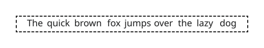
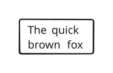
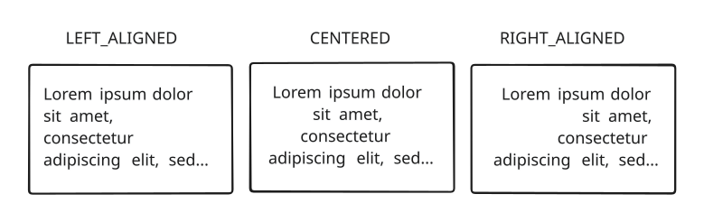

+++
title = "Text symbol element"
+++

# Text symbol element

The [TextSymbolElement]($proto) is used to display text inside a symbol. The colour of the characters, of their outline, the font size, and the thickness of the outline can be configured.
The font size property sets the size of an [em](https://en.wikipedia.org/wiki/Em_(typography)), not that of the whole text. (An em is roughly the height and width of the biggest characters in a font.)

> [!important]
> Text and outline colours support transparency, with their alpha channel. However due to how text is composed from glyphs, non-opaque colours can result in graphical artefacts. Some areas can be drawn multiple times, which affects the resulting colour when transparency is involved. This is especially common with writing systems that use connected characters, such as Arabic.

## Outlines

A coloured outline can be drawn around texts. The thickness of this outline is configured through the properties `outline_width` and `outline_width_unit` of [TextSymbolElement]($proto). Whether the width unit is ems or font unit (i.e. pixels or metres, depending on the anchor's configuration), the maximum outline width is 6/28 ≈ 0.21 ems. Any larger value is automatically capped to this maximum.

## Multiline texts

Text elements also support multi-line texts, with configurable alignment and vertical spacing, as well as text wrapping capabilities. Long lines automatically wrap when reaching the maximum width of the parent container, if there is enough vertical space to fit the additional lines. If a text comprises too many lines, or must wrap too many times, it may not fit vertically. In this case it is cut, and only partially displayed.

The following illustrations show different behaviours of text wrapping:

.")

## Alignment

The following figure shows the different text alignment options:

