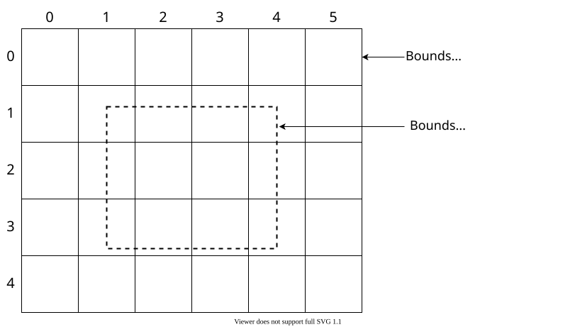
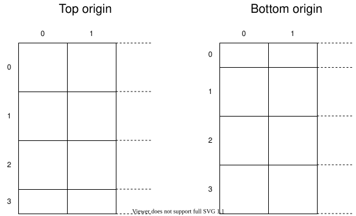
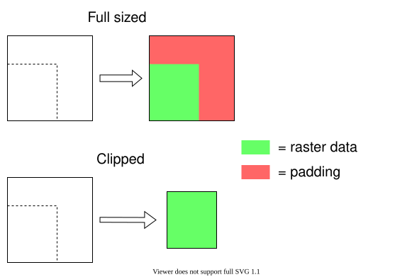

<gallery-card demo="tiledImageRaster"></gallery-card>

Many rasters are not stored as a single image file, because they would be too large to be exploitable. Instead they are tiled into many smaller images. They are multiple ways to tile a raster. The two main types are global and local tilings. Global tiling are built from the top (low zoom tiles) down to the bottom (high zoom tiles): each tile at zoom level _n_ is seen as a division of a tile at level _n - 1_. Conversely, local tiling are built from the bottom, up: low-zoom tiles are made by grouping higher-zoom tiles. The two systems are more or less equivalent, but because they take different parameters, depending on the circumstances one can be more convenient than the other.

In Horizon, such rasters can be displayed using a [tiled raster provider](HrzProtocol.TiledRasterProviderParams.html).

The bounds of the projection domain define where the grid of tiles is laid out (expressed in its coordinate system). The bounds of the raster define where the tiles containing data exist.

    

The bounds above concern purely the source data. The user can also choose to further restrict where the raster is actually displayed by setting display bounds on the layer. The display bounds are always expressed in latitude-longitude degrees ([WGS 84](http://epsg.io/4326)).

## Global tiling

To define a global tiling, one gives the number of tiles on each axis at level 0, and minimum and maximum levels at which tiles are available. From this information, the engine computes tile coordinates for all levels. Each level has tiles whose resolution is doubled on each axis compared to the previous lower level. One level can have as much as four times the number of tiles as its previous lower level, but the exact number depends on the aspect ratio of the domain.

If the image does not fill the whole tiling space, the `bounds` property of [[RasterGeometry]] can be used to specify the covered area.

Multiple well-known map providers use the same tiling parameters:

* Geographic coordinates are projected using web Mercator ([EPSG:3857](https://epsg.io/3857)),
* There is only one tile at level 0,
* Tile coordinates increase eastwards and southwards.

Example include [OpenStreetMap](https://wiki.openstreetmap.org/wiki/Slippy_map_tilenames), [Bing Maps](https://docs.microsoft.com/en-us/bingmaps/articles/bing-maps-tile-system), or [Google Maps](https://developers.google.com/maps/documentation/javascript/coordinates).

Some providers have tile coordinates that increase northwards. This is the case for example for tiles that have been made to the [Tile Map Service](https://wiki.osgeo.org/wiki/Tile_Map_Service_Specification) conventions. (For which a [dedicated provider](raster_providers.html#tile-map-service-tms) exists.) They require using the `{-y}` notation in their URL pattern.

Other tiling schemes, though less common, exist. For example there are tilesets projected using WGS 84 ([EPSG:4326](https://epsg.io/4326), or CRS:84). They have two tiles on the x axis at level 0, and one on the y axis.

Projection domain bounds to not have to be passed when using either the EPSG:3857 or EPSG:4326 projection systems, as they are known to Horizon. Other projection systems require domain bounds to be passed through the API.

## Local tiling

Local tilings are configured with a size in pixels of the raster at its highest level of details (the most zoomed-in), as well as minimum and maximum levels. Tile coordinates for lower levels are computed from this information. Local tilings are convenient when a tile pyramid has been created from a georeferenced image.

### Level offset

For most tilesets, the lowest zoom level fits the whole image into a single tile, of `tile_size` by `tile_size` dimensions. However some tilesets go even further, possibly down to a 1×1-pixel tile. These tilesets are supported by Horizon. Distinguishing between the two is made through the `level_offset` property.

The first case (fully sized tiles) is the default behaviour. The second case, or any intermediate case, is supported by setting the `override_level_offset` property to `true`, and giving a value to `level_offset`. When in this mode, zoom level 0 is considered by the engine to be the one at which the whole image fits into a 1×1 tile. Subsequent zoom levels double in size each time the level is incremented, as usual. The `level_offset` value is then added to the input zoom levels before they are used internally by the engine.

Examples:

* In the common case of a tileset whose lowest-zoom tile is a single 256×256-pixels tile, numbered 0, the default zoom level offset is `8`. This value is used when `override_level_offset` is `false`.
* If a tileset (made of 256×256-pixel tiles) has low-zoom tiles down to a 1×1-pixel tile, numbered 0, use a level offset of `8`.
* If a tileset (made of 256×256-pixel tiles) has low-zoom tiles down to an 8×8-pixel tile, numbered 0, use a level offset of `4` (internal level 0 is 1×1, level 2 is 2×2, level 3 is 4×4, level 4 is 8×8).

### Tiling origin

The size of the origin domain (or image if the image fill its domain) may not correspond to an integer number of tiles. The last tile of a row or a column can be smaller than the other ones. It means that depending on where the first tile of a row or a column is, all the tiles can be shifted.

On the x axis, tiles are pretty universally built from the left, and this is the only case supported by Horizon. However, on the y axis both conventions are used: from the top (`TilingOrigin.TOP_ORIGIN`) or from the bottom (`TilingOrigin.BOTTOM_ORIGIN`).

    

(Inverting how the tiles are named, i.e. in this example swapping `0` and `4`, isn’t controlled by this parameter, but by using `{-y}` in the tile URL pattern.)

## Border tile aspect

There exists two conventions for tiles on the border of rasters. Quite often, the raster bounds do not cover the whole tiles. For some tilesets, these tiles have the same dimensions as any other tile, so they may go beyond the raster's bounds (`BorderTileAspect.FULL_SIZED`). For other tilesets, the tiles are clipped to the raster's bounds, and so they may be smaller than other tiles (`BorderTileAspect.CLIPPED`).

For example, taking the tile 4-1 of the above raster:

    

## Tile URL patterns

Because each tile has a different URL, a URL pattern (and not an actual, directly usage, URL) is passed through the API. The URLs of the tiles are reconstructed from the pattern at runtime.

The URL pattern may contain the following elements:

- `{x}`, `{y}`, `{z}`: tile coordinates in XYZ,
- `{-y}`: reverse Y axis, used for tiles coordinates increasing northwards, like TMS,
- `{quadkey}`: see [Bing Maps Tile System](https://docs.microsoft.com/en-us/bingmaps/articles/bing-maps-tile-system),
- `{c₁-c₂}` where `c₁` and `c₂` are characters between `a` and `z`, `A` and `Z`, or `0` and `9`. Will be replaced randomly by a character in the given range for each request. Used for selecting subdomains. For instance `{B-E}` may be replaced by `B`, `C`, `D`, or `E`. There can only be one of these per URL.
