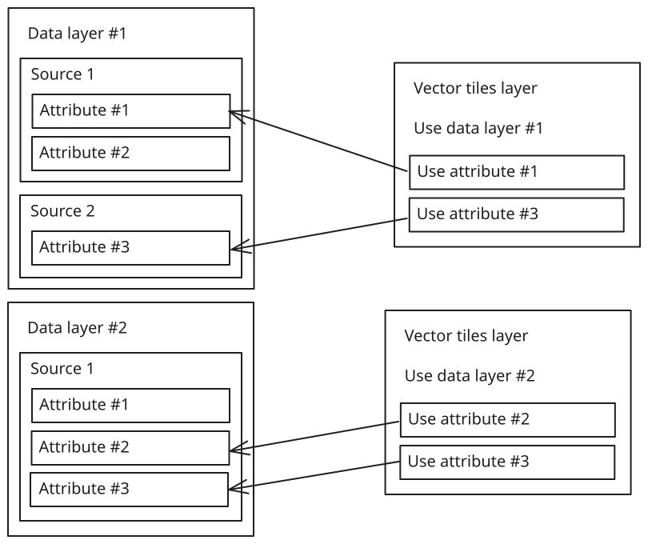

Vector data is made of features, geographically described by geometry data (polygons or points for example), to which attribute values can be associated. Because the same features can be displayed using multiple representations at the same time, customised with several attributes, the same vector data set can be used by multiple layers simultaneously. In order to avoid duplication of the definitions in the API and to avoid unneeded downloads and memory consumption, vector data is declared by the means of a vector data layer.

[Vector data layers](HrzProtocol.VectorDataLayer.html) are virtual layers meant to describe where to fetch vector data from and what it contains. Contrarily to most other layers, vector data layers do not have direct visual representations, instead they make data available to other layers. These other layers refer to a vector data layer through a globally unique identifier, in the form of an integer. Therefore, in order to display vector data you have to declare (at least) two layers: a vector data layer and one (or more) visible layer that uses the vector data.

## Vector data sources

One vector data layer corresponds to one geometry data set. A data set is composed of at most one geometry source and any number of attribute value sources. One source can provide both geometry and attribute values. See the documentation of [[VectorDataSource]].

* The source for geometry allows retrieving the geographical definition of the features: points, polylines, or polygons.
* Attribute values are arbitrary values attached to each feature. They can be numbers, strings, colours, and booleans. These values can be used for styling [vector tile layers](vector_tile_layers.html).

Each [[VectorDataSource]] has a provider, which specifies how its data is retrieved. Multiple options are available:

* [Tiled vector data provider](HrzProtocol.TiledVectorDataProviderParams.html) to download vector data from tiled data sets, in [Mapbox Vector Tile](https://github.com/mapbox/vector-tile-spec), [GeoJSON](https://geojson.org/), or [Geobuf](https://github.com/mapbox/geobuf) formats. The data must be tiled with the [XYZ tiling scheme](https://wiki.openstreetmap.org/wiki/Slippy_map_tilenames).
* [Untiled vector data provider](HrzProtocol.UntiledVectorDataProviderParams.html) to download vector data from untiled data sets (in [GeoJSON](https://geojson.org/) or [Geobuf](https://github.com/mapbox/geobuf) formats) and tile it automatically, simplifying and clipping features as needed.
    * The bounds of the resulting tileset are the intersection of the source file’s data bounds and the bounds in the parameters of the vector data source.
    * Levels of detail are provided for as long as zooming in is necessary to resolve small features. The source’s `max_level` is used as an upper bound. (A large value can be used for `max_level` to let the engine decide when to stop.)
    * The degree of simplification can be tuned with the `tolerance` parameter.
    * When compared to setting up a tiled vector data provider with a single level-0 tile, this option improves performance and eliminates position jitter, at the cost of increased memory usage and loading time. But keep in mind that it is always preferable to perform tiling offline as a pre-processing step (for example, by using a tool such as [Tippecanoe](https://github.com/mapbox/tippecanoe)).
* [TileJSON vector data provider](HrzProtocol.TileJsonVectorDataProviderParams.html) to download vector data from [Mapbox Vector Tile](https://github.com/mapbox/vector-tile-spec) tiled data sets, using [TileJSON](https://github.com/mapbox/tilejson-spec) layer descriptor files to determine how tiles can be retrieved. (Note that although TileJSON files can describe feature attributes, they still have to be declared explicitly in the vector data layer, so that they can be assigned numerical IDs and value transforms.)
* [PMTiles vector data provider](HrzProtocol.PmTilesVectorDataProviderParams.html) to download data from a [PMTiles version 3](https://github.com/protomaps/PMTiles/tree/main) file, using range requests. Just like with the TileJSON provider, attributes must also be declared explicitly.
* [In-memory vector data provider](HrzProtocol.InMemoryVectorDataProviderParams.html) to retrieve data stored in [in-memory vector data layers](client_vector_data.html#in-memory-vector-source).
* [Client vector data provider](HrzProtocol.ClientVectorDataProviderParams.html) to [ask the client](client_vector_data.html#client-vector-data) for attribute values.

Providers must provide the extents of their data set. This includes the minimum and maximum LODs, as well as geographical bounds. They are either declared explicitly in the parameters, or determined automatically from the source data. (One notable exception is the client vector data provider, when it is configured to get data by feature ID: it does not have geographical bounds.) The resulting bounds of the whole vector data layer is the intersection of all the vector data sources’ bounds.

## Geometries

Every feature can be associated to one or more geometry. Geometries are 2D shapes whose vertices are locations on the planet. Geometries can be:

* Points: single positions, to which for example [symbols](symbols.html) can be attached.
* Polylines: linear features made of a list of positions, defining a string of straight segments. They can be visualised among others as a series of tubes with [cylinders](cylinders.html).
* Polygons: features with surfaces, that can contain holes. They can for instance be turned into volumes by [extruding them](extruded_vectors.html).

Internally (and in most datasets) the [Web Mercator](https://epsg.io/3857) projection is used to store coordinate. This makes impossible to represent geometries near the poles, namely above 85.06°N and below 85.06°S.

!!! note "Geometries are optional"
    Geometries are necessary when the data is meant to be displayed with a [vector tile layer](vector_tile_layers.html), because without geometries that layer would have nothing to draw.

    However vector data layers support having no source for geometry, and be attribute-only layers. This is sufficient (and recommended) when using a vector data layer to [style a 3D Tiles layer](styling_3d_tiles.html).

## Attributes

Attributes are collections of values attached to features. There can be multiple attributes in one vector data layer. One attribute is provided by one vector data source. Each attribute is identified by a unique integer. When another layer needs attribute values (for example when styling feature representations), it refers to the attribute by this integer ID. The client is responsible for choosing these integer identifiers when setting up the vector data layer. Horizon does not care about the values themselves, only that the references are consistent inside the scene. Inside one vector data layer, each attribute must have its own unique ID. Attribute IDs are local to their vector data layer so the same IDs can be used in multiple vector data layers without any risk of mixing the attribute values.

    

See the [vector attributes](vector_attributes.html) page for information about attribute values, types, and transforms.

Inside GeoJSON, MVT, and Geobuf files, attributes are given string names. For each attribute, fill the property `source_name` with the name of the attribute inside the data source file. In-memory and client vector sources use the attribute IDs directly, so there is no need to specify this property.

GeoJSON, MVT, and Geobuf files can define IDs for each feature as a virtual attribute that has no name, and thus cannot be addressed using `source_name`. They can be loaded as attributes by setting the `is_source_feature_ids` property of [[VectorAttribute]] to `true`, instead of using the `source_name` property.

## Feature IDs

Within a vector data set, each feature can be optionally uniquely identified by a tuple of one or multiple attribute values, referred to as its ID. Typically this ID is a single integer number, guaranteed by the dataset producer to be unique for each feature. When feature IDs are made of single value, they are named simple IDs. When they are made of multiple values, they are named composite IDs.

Each attribute has an `is_feature_id` property. Set it to `true` in order to include the values of that attribute in the feature IDs. The definition of the feature IDs for the layer can though of the unordered list of the attribute IDs that are set to be part of the IDs.

!!! note ""
    When loading source IDs into an attribute with the `is_source_feature_ids` property, it is still necessary to set `is_feature_id` to `true` as well if the attribute is meant to be a constituent of feature IDs in the vector data layer.

Feature IDs are necessary for some functionalities:

* Identifying a picked feature,
* Selecting and highlighting features,
* Joining attribute values from multiple sources in the same vector data layer when all sources do not guarantee to provide data for all features, or respecting the same order of features.
* Requesting values from the client by feature ID.
* Using attribute values from vector data layers to style 3D Tiles.

In some simple cases, it is not necessary to declare feature IDs. For example when a vector data layer does not join multiple sources by feature ID, is used by vector tile layers, and picking or selection/highlighting are not needed.

## Request by tile coordinates or by feature IDs

When another layer needs data from a vector data layer, it has two ways of requesting this data: by tile coordinates or with a list of feature IDs. [Vector tile layers](vector_tile_layers.html) request data by tile coordinates. 3D Tiles layers, when they [use a vector data layer to style their contents](styling_3d_tiles.html), request data by feature IDs.

A request by tile coordinates is for a well-defined geographical area on the planet. The tiling scheme is the Web-Mercator-based [XYZ tiling scheme](https://wiki.openstreetmap.org/wiki/Slippy_map_tilenames).

A request by feature IDs is for a precise list of features, that have been identified by their ID. The list can consist of a single feature ID.

Data source providers themselves can provide data for one or both request types:

* The [tiled vector data provider](HrzProtocol.TiledVectorDataProviderParams.html) fetches data from tiled remote datasets, and therefore only supports requests by tile coordinates.
* The [TileJSON vector data provider](HrzProtocol.TileJsonVectorDataProviderParams.html) and the [PMTiles vector data provider](HrzProtocol.PmTilesVectorDataProviderParams.html) are alternative ways to access tiled datasets so they also only support requests by tile coordinates.
* The [untiled vector data provider](HrzProtocol.UntiledVectorDataProviderParams.html) generates a tiled dataset from a large single-file dataset. It only support requests by tile coordinates.
* The [in-memory vector data provider](HrzProtocol.InMemoryVectorDataProviderParams.html) supports both requests by tile coordinates or by feature IDs. Feature ID attributes have to be defined for requests by feature IDs to work.
* The [client vector data provider](HrzProtocol.ClientVectorDataProviderParams.html) supports both requests by tile coordinates or by feature IDs, but only one at a time. This is configured through the `access` property of the provider. If the requests are by feature IDs, feature ID attributes must be defined. It is up to the client to respond to the requests when they are emitted, so a working integration should support the type of requests it has declared in the provider’s configuration.

Because a provider can only respond to the request types it supports, suitable source data and providers for the data users (vector tile layers and 3D Tiles layers) must be used.

## Joining multiple vector data sources

Vector data layers can combine data from multiple sources, and expose this data to other systems as if it comes from a single dataset.

When multiple data sources are joined, one source is the primary source and the others are secondary sources. The primary source is always the first one in the `sources` array of [[VectorDataLayer]] (at index `0`). The secondary sources are the ones that follow. The primary source is the one that determines how many features there are in each tile and if feature IDs are used, what they are. Although it is the case most of the time, the primary source does not have to be the one bringing geometry in.

Horizon can join multiple sources with either of two mechanisms: joining features using their order in the source data files, or matching features using their IDs. It is possible to have some secondary sources by joined by feature order and others by feature ID in the same vector data layer.

### Join by feature order

This mechanism is the simpler of the two, but is more limited. Because it works without feature IDs it can only be used with data sources that are requested by tile coordinates. It works by requesting data from the primary and secondary sources, then constituting the joined dataset by simply aligning the values. If a secondary source has too many values, the ones at the end are ignored. If it is missing values, `null`s and empty geometries are used to reach the required count.

#### Example

##### Primary source

<table class="centered-content">
    <thead>
        <tr>
            <th>Geometry</th>
            <th>Attribute 1 (population)</th>
        </tr>
    </thead>
    <tbody>
        <tr>
            <td></td>
            <td>66,834,405</td>
        </tr>
        <tr>
            <td></td>
            <td>67,059,887</td>
        </tr>
        <tr>
            <td></td>
            <td>83,132,799</td>
        </tr>
        <tr>
            <td></td>
            <td>47,076,781</td>
        </tr>
        <tr>
            <td></td>
            <td>60,297,396</td>
        </tr>
        <tr>
            <td></td>
            <td>37,970,874</td>
        </tr>
    </tbody>
</table>

##### Secondary source

<table class="centered-content">
    <thead>
        <tr>
            <th>Attribute 2 (name)</th>
        </tr>
    </thead>
    <tbody>
        <tr>
            <td style="font-family: monospace">"United Kingdom"</td>
        </tr>
        <tr>
            <td style="font-family: monospace">"France"</td>
        </tr>
        <tr>
            <td style="font-family: monospace">"Germany"</td>
        </tr>
        <tr>
            <td style="font-family: monospace">"Spain"</td>
        </tr>
        <tr>
            <td style="font-family: monospace">"Italy"</td>
        </tr>
    </tbody>
</table>

##### Joined data

<table class="centered-content">
    <thead>
        <tr>
            <th>Geometry</th>
            <th>Attribute 1 (population)</th>
            <th>Attribute 2 (name)</th>
        </tr>
    </thead>
    <tbody>
        <tr>
            <td></td>
            <td>66,834,405</td>
            <td style="font-family: monospace">"United Kingdom"</td>
        </tr>
        <tr>
            <td></td>
            <td>67,059,887</td>
            <td style="font-family: monospace">"France"</td>
        </tr>
        <tr>
            <td></td>
            <td>83,132,799</td>
            <td style="font-family: monospace">"Germany"</td>
        </tr>
        <tr>
            <td></td>
            <td>47,076,781</td>
            <td style="font-family: monospace">"Spain"</td>
        </tr>
        <tr>
            <td></td>
            <td>60,297,396</td>
            <td style="font-family: monospace">"Italy"</td>
        </tr>
        <tr>
            <td></td>
            <td>37,970,874</td>
            <td style="font-style: italic">(null)</td>
        </tr>
    </tbody>
</table>

The source for attribute 2 only had five data entries, when the primary source had six. The last value for attribute 2 has been filled with a null value.

### Join by feature ID

This mechanism requires feature IDs to be available and defined on both primary and secondary sources. It is chosen by defining the same feature ID attributes on both sources, which is achieved by declaring attributes with the same IDs and setting `is_feature_id` to `true` on them. The number of feature ID attributes and their IDs must be a perfect match.

When data is requested by tile coords, the primary source determines the list of features to be returned. When data is requested by feature ID, the same feature ID list is used for all sources. Data is reordered so that one feature is automatically associated to its data, as defined by the feature IDs. If a feature ID is not present in a source´s data, `null`s and empty geometries are used to replace the missing data.

This join type can be used when requesting data from the client. If the source is configured with access by feature IDs, as long as the client can respond to vector data requests in the order features are in in the request, it is less resource intensive to use joins by feature order.

#### Example with simple IDs

##### Primary source

<table class="centered-content">
    <thead>
        <tr>
            <th>Attribute 1 (WOEID) – Feature ID</th>
            <th>Attribute 2 (population)</th>
        </tr>
    </thead>
    <tbody>
        <tr>
            <td>23424923</td>
            <td>37,970,874</td>
        </tr>
        <tr>
            <td>23424950</td>
            <td>47,076,781</td>
        </tr>
        <tr>
            <td>23424853</td>
            <td>60,297,396</td>
        </tr>
        <tr>
            <td>23424975</td>
            <td>66,834,405</td>
        </tr>
        <tr>
            <td>23424819</td>
            <td>67,059,887</td>
        </tr>
        <tr>
            <td>23424829</td>
            <td>83,132,799</td>
        </tr>
    </tbody>
</table>

##### Secondary source 1

<table class="centered-content">
    <thead>
        <tr>
            <th>Attribute 1 (WOEID) – Feature ID</th>
            <th>Geometry</th>
        </tr>
    </thead>
    <tbody>
        <tr>
            <td>23424950</td>
            <td></td>
        </tr>
        <tr>
            <td>23424975</td>
            <td></td>
        </tr>
        <tr>
            <td>23424819</td>
            <td></td>
        </tr>
        <tr>
            <td>23424829</td>
            <td></td>
        </tr>
        <tr>
            <td>23424853</td>
            <td></td>
        </tr>
        <tr>
            <td>23424923</td>
            <td></td>
        </tr>
        <tr>
            <td>23424976</td>
            <td></td>
        </tr>
    </tbody>
</table>

##### Secondary source 2

<table class="centered-content">
    <thead>
        <tr>
            <th>Attribute 1 (WOEID) – Feature ID</th>
            <th>Attribute 3 (name)</th>
        </tr>
    </thead>
    <tbody>
        <tr>
            <td>23424819</td>
            <td style="font-family: monospace">"France"</td>
        </tr>
        <tr>
            <td>23424829</td>
            <td style="font-family: monospace">"Germany"</td>
        </tr>
        <tr>
            <td>23424923</td>
            <td style="font-family: monospace">"Poland"</td>
        </tr>
        <tr>
            <td>23424950</td>
            <td style="font-family: monospace">"Spain"</td>
        </tr>
        <tr>
            <td>23424975</td>
            <td style="font-family: monospace">"United Kingdom"</td>
        </tr>
    </tbody>
</table>

##### Joined data

<table>
    <thead>
        <tr>
            <th>Attribute 1 (WOEID) – Feature ID</th>
            <th>Geometry</th>
            <th>Attribute 2 (population)</th>
            <th>Attribute 3 (name)</th>
        </tr>
    </thead>
    <tbody>
        <tr>
            <td>23424923</td>
            <td></td>
            <td>37,970,874</td>
            <td style="font-family: monospace">"Poland"</td>
        </tr>
        <tr>
            <td>23424950</td>
            <td></td>
            <td>47,076,781</td>
            <td style="font-family: monospace">"Spain"</td>
        </tr>
        <tr>
            <td>23424853</td>
            <td></td>
            <td>60,297,396</td>
            <td style="font-style: italic">(null)</td>
        </tr>
        <tr>
            <td>23424975</td>
            <td></td>
            <td>66,834,405</td>
            <td style="font-family: monospace">"United Kingdom"</td>
        </tr>
        <tr>
            <td>23424819</td>
            <td></td>
            <td>67,059,887</td>
            <td style="font-family: monospace">"France"</td>
        </tr>
        <tr>
            <td>23424829</td>
            <td></td>
            <td>83,132,799</td>
            <td style="font-family: monospace">"Germany"</td>
        </tr>
    </tbody>
</table>

Attribute 1 has been configured as a feature ID attribute. All data sources have this attribute in their definition. The features are matched using the values of this attribute, which can be used as such because it guarantees unique values for all features.

The source for geometry had an entry that did not match any feature ID in the primary source. It has been discarded.

The source for attribute 3 had no entry matching feature ID 23424853 in the primary source. A null value has been used instead.

#### Example with composite IDs

Features IDs in this example are composite and made from two attributes. Neither of the two attributes are enough to uniquely identify every feature.

##### Primary source

<table class="centered-content">
    <thead>
        <tr>
            <th>Attribute 1 (road number) – Feature ID</th>
            <th>Attribute 2 (exit number) – Feature ID</th>
            <th>Attribute 3 (geometry)</th>
        </tr>
    </thead>
    <tbody>
        <tr>
            <td style="font-family: monospace">"N 136"</td>
            <td style="font-family: monospace">"1"</td>
            <td>(-174884, 6126086)</td>
        </tr>
        <tr>
            <td style="font-family: monospace">"N 136"</td>
            <td style="font-family: monospace">"6a"</td>
            <td>(-186468, 6120281)</td>
        </tr>
        <tr>
            <td style="font-family: monospace">"N 136"</td>
            <td style="font-family: monospace">"9"</td>
            <td>(-191014, 6123837)</td>
        </tr>
        <tr>
            <td style="font-family: monospace">"N 136"</td>
            <td style="font-family: monospace">"10"</td>
            <td>(-191173, 6124727)</td>
        </tr>
        <tr>
            <td style="font-family: monospace">"N 136"</td>
            <td style="font-family: monospace">"11"</td>
            <td>(-191474, 6126778)</td>
        </tr>
        <tr>
            <td style="font-family: monospace">"N 844"</td>
            <td style="font-family: monospace">"33"</td>
            <td>(-180545, 5978909)</td>
        </tr>
        <tr>
            <td style="font-family: monospace">"A 11"</td>
            <td style="font-family: monospace">"37"</td>
            <td>(-176697, 5985546)</td>
        </tr>
        <tr>
            <td style="font-family: monospace">"N 814"</td>
            <td style="font-family: monospace">"1"</td>
            <td>(-33520, 6303625)</td>
        </tr>
        <tr>
            <td style="font-family: monospace">"N 814"</td>
            <td style="font-family: monospace">"9"</td>
            <td>(-47665, 6302778)</td>
        </tr>
        <tr>
            <td style="font-family: monospace">"N 814"</td>
            <td style="font-family: monospace">"3b"</td>
            <td>(-37386, 6307670)</td>
        </tr>
        <tr>
            <td style="font-family: monospace">"N 814"</td>
            <td style="font-family: monospace">"13"</td>
            <td>(-37713, 6299618)</td>
        </tr>
    </tbody>
</table>

##### Secondary source

<table class="centered-content">
    <thead>
        <tr>
            <th>Attribute 1 (road number) – Feature ID</th>
            <th>Attribute 2 (exit number) – Feature ID</th>
            <th>Attribute 4 (name)</th>
        </tr>
    </thead>
    <tbody>
        <tr>
            <td style="font-family: monospace">"N 814"</td>
            <td style="font-family: monospace">"3b"</td>
            <td style="font-family: monospace">"Porte d’Angleterre"</td>
        </tr>
        <tr>
            <td style="font-family: monospace">"N 844"</td>
            <td style="font-family: monospace">"33"</td>
            <td style="font-family: monospace">"Porte d’ar Mor"</td>
        </tr>
        <tr>
            <td style="font-family: monospace">"N 136"</td>
            <td style="font-family: monospace">"11"</td>
            <td style="font-family: monospace">"Porte de Brest"</td>
        </tr>
        <tr>
            <td style="font-family: monospace">"N 814"</td>
            <td style="font-family: monospace">"9"</td>
            <td style="font-family: monospace">"Porte de Bretagne"</td>
        </tr>
        <tr>
            <td style="font-family: monospace">"N 136"</td>
            <td style="font-family: monospace">"9"</td>
            <td style="font-family: monospace">"Porte de Cleunay"</td>
        </tr>
        <tr>
            <td style="font-family: monospace">"N 136"</td>
            <td style="font-family: monospace">"10"</td>
            <td style="font-family: monospace">"Porte de Lorient"</td>
        </tr>
        <tr>
            <td style="font-family: monospace">"N 136"</td>
            <td style="font-family: monospace">"6a"</td>
            <td style="font-family: monospace">"Porte de Nantes"</td>
        </tr>
        <tr>
            <td style="font-family: monospace">"N 814"</td>
            <td style="font-family: monospace">"1"</td>
            <td style="font-family: monospace">"Porte de Paris"</td>
        </tr>
        <tr>
            <td style="font-family: monospace">"A 11"</td>
            <td style="font-family: monospace">"37"</td>
            <td style="font-family: monospace">"Porte de Rennes"</td>
        </tr>
        <tr>
            <td style="font-family: monospace">"N 136"</td>
            <td style="font-family: monospace">"1"</td>
            <td style="font-family: monospace">"Porte de la Rigourdière"</td>
        </tr>
        <tr>
            <td style="font-family: monospace">"N 814"</td>
            <td style="font-family: monospace">"13"</td>
            <td style="font-family: monospace">"Porte d’Espagne"</td>
        </tr>
    </tbody>
</table>

##### Joined data

<table class="centered-content">
    <thead>
        <tr>
            <th>Attribute 1 (road number) – Feature ID</th>
            <th>Attribute 2 (exit number) – Feature ID</th>
            <th>Attribute 3 (geometry)</th>
            <th>Attribute 4 (name)</th>
        </tr>
    </thead>
    <tbody>
        <tr>
            <td style="font-family: monospace">"N 136"</td>
            <td style="font-family: monospace">"1"</td>
            <td>(-174884, 6126086)</td>
            <td style="font-family: monospace">"Porte de la Rigourdière"</td>
        </tr>
        <tr>
            <td style="font-family: monospace">"N 136"</td>
            <td style="font-family: monospace">"6a"</td>
            <td>(-186468, 6120281)</td>
            <td style="font-family: monospace">"Porte de Nantes"</td>
        </tr>
        <tr>
            <td style="font-family: monospace">"N 136"</td>
            <td style="font-family: monospace">"9"</td>
            <td>(-191014, 6123837)</td>
            <td style="font-family: monospace">"Porte de Cleunay"</td>
        </tr>
        <tr>
            <td style="font-family: monospace">"N 136"</td>
            <td style="font-family: monospace">"10"</td>
            <td>(-191173, 6124727)</td>
            <td style="font-family: monospace">"Porte de Lorient"</td>
        </tr>
        <tr>
            <td style="font-family: monospace">"N 136"</td>
            <td style="font-family: monospace">"11"</td>
            <td>(-191474, 6126778)</td>
            <td style="font-family: monospace">"Porte de Brest"</td>
        </tr>
        <tr>
            <td style="font-family: monospace">"N 844"</td>
            <td style="font-family: monospace">"33"</td>
            <td>(-180545, 5978909)</td>
            <td style="font-family: monospace">"Porte d’ar Mor"</td>
        </tr>
        <tr>
            <td style="font-family: monospace">"A 11"</td>
            <td style="font-family: monospace">"37"</td>
            <td>(-176697, 5985546)</td>
            <td style="font-family: monospace">"Porte de Rennes"</td>
        </tr>
        <tr>
            <td style="font-family: monospace">"N 814"</td>
            <td style="font-family: monospace">"1"</td>
            <td>(-33520, 6303625)</td>
            <td style="font-family: monospace">"Porte de Paris"</td>
        </tr>
        <tr>
            <td style="font-family: monospace">"N 814"</td>
            <td style="font-family: monospace">"9"</td>
            <td>(-47665, 6302778)</td>
            <td style="font-family: monospace">"Porte de Bretagne"</td>
        </tr>
        <tr>
            <td style="font-family: monospace">"N 814"</td>
            <td style="font-family: monospace">"3b"</td>
            <td>(-37386, 6307670)</td>
            <td style="font-family: monospace">"Porte d’Angleterre"</td>
        </tr>
        <tr>
            <td style="font-family: monospace">"N 814"</td>
            <td style="font-family: monospace">"13"</td>
            <td>(-37713, 6299618)</td>
            <td style="font-family: monospace">"Porte d’Espagne"</td>
        </tr>
    </tbody>
</table>

## Invalidating vector data

Vector data used by Horizon can be invalidated using the `InvalidateVectorData` method of [[ClientDataService]]. When data is invalidated, it will be requested and loaded again. Which data should be invalidated is determined by the [parameters passed to the method](HrzProtocol.VectorDataInvalidation.html).

First, a specific [[VectorDataSource]] should be identified with a `vector_data_layer_id` and `vector_data_source_index` (the latter being the index of the source in the `sources` array of the [layer definition](HrzProtocol.VectorDataLayer.html)).

!!! note ""
    Despite using a method of [[ClientDataService]] to invalidate data, any vector data source can be invalidated, not just the ones with client providers.

Then, the `selection` union is used to determine which features should be invalidated.

- If `tile_coords` is set, all features of the corresponding tile will be invalidated.
- If `feature_ids` is set, all features with the given IDs will be invalidated (some other features may also be invalidated with them).
- If `everything` is set, then all features within the data layer will be invalidated.

!!! note "Vector data sources and data invalidation"
    It should be noted that the contents of a vector data request is determined by the contents of its associated [[VectorDataSource]]. For instance:

    - If a vector data layer has one source defining two attributes, then the two attributes will be requested within the same message.
    - If a vector data layer has two sources defining one attribute each, then the two attributes will be requested separately.

    This has important consequences when invalidating the values of one of the two attributes:

    - In the first case, a single request will be sent, asking for the values of both attributes again, as both are defined in the same vector data source.
    - In the second case, a single request will also be sent, but asking for the values of the invalidated attribute only, as the other attribute originates from a different source.

    As such, if it is known that the values of a specific attribute will be frequently invalidated, it is advised to define this attribute in a separate source.

## Examples

<gallery-card demo="csvData"></gallery-card>

<gallery-card demo="localization"></gallery-card>
